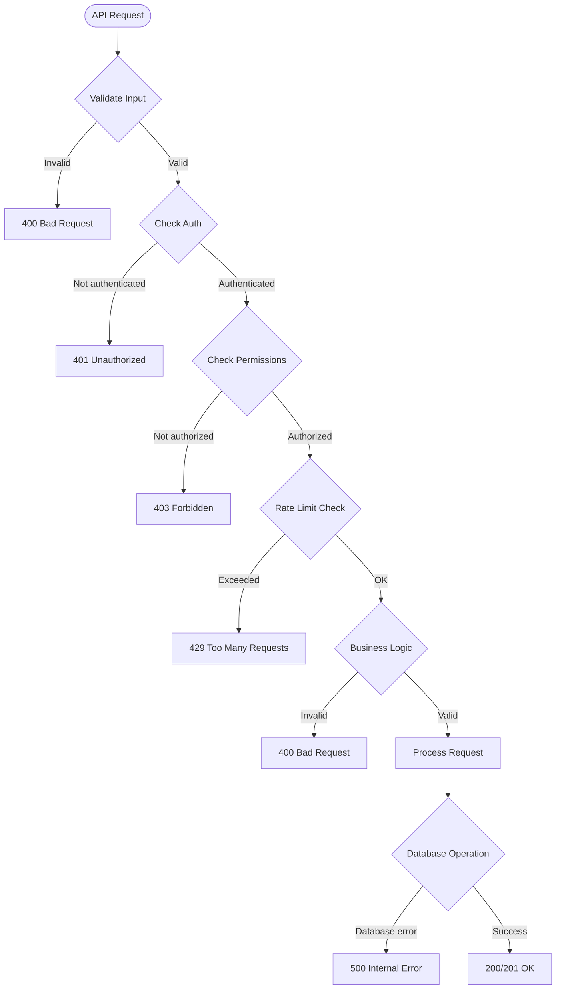

# League Ladder API Documentation

Complete API reference for the League Ladder application.

**Base URL**: `https://leagueladderapp.vercel.app/api` (production) or `http://localhost:3000/api` (local)

**Last Updated**: January 2026

---

## Table of Contents

1. [Authentication](#authentication)
2. [Health & System](#health--system)
3. [Leagues](#leagues)
4. [Challenges](#challenges)
5. [Matches](#matches)
6. [Players](#players)
7. [Leaderboards](#leaderboards)
8. [User](#user)
9. [Admin](#admin)

---

## Authentication

Most endpoints require authentication via NextAuth.js session cookies. Authentication is handled automatically through the NextAuth.js middleware.

### NextAuth Endpoints

#### `GET /api/auth/[...nextauth]`
#### `POST /api/auth/[...nextauth]`

NextAuth.js authentication endpoints. Handles login, logout, and session management.

**Available Routes:**
- `GET /api/auth/signin` - Sign in page
- `POST /api/auth/signin/credentials` - Sign in request
- `GET /api/auth/signout` - Sign out
- `GET /api/auth/session` - Get current session
- `GET /api/auth/csrf` - Get CSRF token

**Request Example (Sign In):**
```json
POST /api/auth/signin/credentials
Content-Type: application/json

{
  "email": "user@example.com",
  "password": "password123",
  "redirect": false
}
```

**Response Example:**
```json
{
  "ok": true,
  "status": 200,
  "url": null,
  "error": null
}
```

**Status Codes:**
- `200` - Success
- `401` - Invalid credentials
- `500` - Server error

---

## Health & System

### Health Check

#### `GET /api/health`

Check if the API is running.

**Authentication:** Not required

**Response:**
```json
{
  "status": "healthy",
  "timestamp": "2026-01-26T10:30:00.000Z",
  "service": "league-ladder-api"
}
```

**Status Codes:**
- `200` - Service is healthy

---

### Database Initialization

#### `GET /api/db/init`

Initialize database schema (development only).

**Authentication:** Not required (should be restricted in production)

**Response:**
```json
{
  "success": true,
  "message": "Database initialized"
}
```

---

## Leagues

### Get All Leagues

#### `GET /api/leagues`

Get all available leagues.

**Authentication:** Not required

**Response:**
```json
{
  "leagues": [
    {
      "id": "fifa_league",
      "name": "FIFA League",
      "game_type": "fifa",
      "created_at": "2026-01-01T00:00:00.000Z"
    },
    {
      "id": "tt_league",
      "name": "Table Tennis League",
      "game_type": "table-tennis",
      "created_at": "2026-01-01T00:00:00.000Z"
    }
  ]
}
```

**Status Codes:**
- `200` - Success
- `500` - Server error

---

### Join League

#### `POST /api/leagues/join`

Join a league. Creates a player profile if one doesn't exist and initializes rating at 1000.

**Authentication:** Required

**Request Body:**
```json
{
  "leagueId": "fifa_league"
}
```

**Response:**
```json
{
  "success": true,
  "message": "Successfully joined league"
}
```

**Error Responses:**

```json
{
  "error": "Unauthorized"
}
```
Status: `401` - User not authenticated

```json
{
  "error": "League ID is required"
}
```
Status: `400` - Missing leagueId

```json
{
  "error": "Already joined this league"
}
```
Status: `400` - Player is already a member

**Status Codes:**
- `200` - Success
- `400` - Bad request
- `401` - Unauthorized
- `404` - User/league not found
- `500` - Server error

---

### Check League Membership

#### `GET /api/leagues/[leagueId]/membership`

Check if the current authenticated user is a member of a specific league.

**Authentication:** Optional (returns `isMember: false` if not authenticated)

**Path Parameters:**
- `leagueId` - The ID of the league (e.g., `fifa_league`, `tt_league`)

**Response:**
```json
{
  "isMember": true
}
```

**Status Codes:**
- `200` - Success (always returns, even if not authenticated)

---

### Get League Statistics

#### `GET /api/leagues/[leagueId]/stats`

Get statistics for a specific league.

**Authentication:** Not required

**Path Parameters:**
- `leagueId` - The ID of the league

**Response:**
```json
{
  "playerCount": 15
}
```

**Status Codes:**
- `200` - Success

---

### Get League Matches

#### `GET /api/leagues/[leagueId]/matches`

Get match history for a specific league.

**Authentication:** Not required

**Path Parameters:**
- `leagueId` - The ID of the league

**Query Parameters:**
- `limit` - Number of matches to return (optional, default: 50)

**Response:**
```json
{
  "matches": [
    {
      "id": "match-uuid",
      "player1_id": "player-uuid",
      "player2_id": "player-uuid",
      "player1_name": "John Doe",
      "player2_name": "Jane Smith",
      "player1_score": 3,
      "player2_score": 1,
      "winner_id": "player-uuid",
      "league_name": "FIFA League",
      "played_at": "2026-01-15T09:00:00.000Z",
      "status": "completed",
      "rating_updates": {
        "player1": {
          "old_rating": 1000,
          "new_rating": 1032,
          "change": 32
        },
        "player2": {
          "old_rating": 1000,
          "new_rating": 968,
          "change": -32
        }
      }
    }
  ]
}
```

**Status Codes:**
- `200` - Success
- `404` - League not found
- `500` - Server error

---

### Get League Match Count

#### `GET /api/leagues/[leagueId]/matches/count`

Get total count of completed matches for a specific league.

**Authentication:** Not required

**Path Parameters:**
- `leagueId` - The ID of the league

**Response:**
```json
{
  "count": 42
}
```

**Status Codes:**
- `200` - Success

---

## Challenges

### Get All Challenges

#### `GET /api/challenges`

Get all challenges for the authenticated player (both incoming and outgoing).

**Authentication:** Required

**Response:**
```json
{
  "challenges": [
    {
      "id": "challenge-uuid",
      "challenger_id": "player-uuid",
      "challengee_id": "player-uuid",
      "league_id": "fifa_league",
      "status": "pending",
      "created_at": "2026-01-15T10:00:00.000Z",
      "expires_at": "2026-01-22T10:00:00.000Z",
      "challenger_name": "John Doe",
      "challengee_name": "Jane Smith",
      "league_name": "FIFA League"
    }
  ]
}
```

**Status Codes:**
- `200` - Success
- `401` - Unauthorized
- `500` - Server error

---

### Get Incoming Challenges

#### `GET /api/challenges/incoming`

Get challenges sent to the authenticated player.

**Authentication:** Required

**Response:**
```json
{
  "challenges": [
    {
      "id": "challenge-uuid",
      "challenger_id": "player-uuid",
      "challengee_id": "player-uuid",
      "league_id": "fifa_league",
      "status": "pending",
      "created_at": "2026-01-15T10:00:00.000Z",
      "expires_at": "2026-01-22T10:00:00.000Z",
      "challenger_name": "John Doe",
      "challengee_name": "Jane Smith",
      "league_name": "FIFA League"
    }
  ]
}
```

**Status Codes:**
- `200` - Success
- `401` - Unauthorized
- `500` - Server error

---

### Get Outgoing Challenges

#### `GET /api/challenges/outgoing`

Get challenges sent by the authenticated player.

**Authentication:** Required

**Response:**
```json
{
  "challenges": [
    {
      "id": "challenge-uuid",
      "challenger_id": "player-uuid",
      "challengee_id": "player-uuid",
      "league_id": "fifa_league",
      "status": "pending",
      "created_at": "2026-01-15T10:00:00.000Z",
      "expires_at": "2026-01-22T10:00:00.000Z",
      "challenger_name": "John Doe",
      "challengee_name": "Jane Smith",
      "league_name": "FIFA League"
    }
  ]
}
```

**Status Codes:**
- `200` - Success
- `401` - Unauthorized
- `500` - Server error

---

### Create Challenge

#### `POST /api/challenges`

Create a new challenge to another player.

**Authentication:** Required

**Request Body:**
```json
{
  "challengeeId": "player-uuid",
  "leagueId": "fifa_league"
}
```

**Response:**
```json
{
  "success": true,
  "challengeId": "challenge-uuid",
  "message": "Challenge created successfully"
}
```

**Error Responses:**

```json
{
  "error": "Challengee ID and League ID are required"
}
```
Status: `400` - Missing required fields

```json
{
  "error": "Both players must be in the same league"
}
```
Status: `400` - Players not in same league

```json
{
  "error": "A pending challenge already exists between these players in this league"
}
```
Status: `400` - Duplicate challenge

```json
{
  "error": "Cannot challenge yourself"
}
```
Status: `400` - Self-challenge attempt

**Status Codes:**
- `200` - Success
- `400` - Bad request
- `401` - Unauthorized
- `404` - User/player not found
- `500` - Server error

---

### Accept Challenge

#### `POST /api/challenges/[challengeId]/accept`

Accept a pending challenge.

**Authentication:** Required

**Path Parameters:**
- `challengeId` - The UUID of the challenge

**Response:**
```json
{
  "success": true,
  "message": "Challenge accepted successfully"
}
```

**Error Responses:**

```json
{
  "error": "Challenge not found or you are not authorized to accept it"
}
```
Status: `404` - Challenge not found or unauthorized

```json
{
  "error": "Challenge is not pending"
}
```
Status: `400` - Challenge already processed

```json
{
  "error": "This challenge has expired"
}
```
Status: `400` - Challenge expired

**Status Codes:**
- `200` - Success
- `400` - Bad request
- `401` - Unauthorized
- `404` - Challenge not found
- `500` - Server error

---

### Decline Challenge

#### `POST /api/challenges/[challengeId]/decline`

Decline a pending challenge.

**Authentication:** Required

**Path Parameters:**
- `challengeId` - The UUID of the challenge

**Response:**
```json
{
  "success": true,
  "message": "Challenge declined successfully"
}
```

**Error Responses:**

```json
{
  "error": "Challenge not found or you are not authorized to decline it"
}
```
Status: `404` - Challenge not found or unauthorized

```json
{
  "error": "Challenge is not pending"
}
```
Status: `400` - Challenge already processed

**Status Codes:**
- `200` - Success
- `400` - Bad request
- `401` - Unauthorized
- `404` - Challenge not found
- `500` - Server error

---

### Cancel Challenge

#### `POST /api/challenges/[challengeId]/cancel`

Cancel a challenge you created (challenger only).

**Authentication:** Required

**Path Parameters:**
- `challengeId` - The UUID of the challenge

**Response:**
```json
{
  "success": true,
  "message": "Challenge cancelled successfully"
}
```

**Error Responses:**

```json
{
  "error": "Challenge not found or you are not authorized to cancel it"
}
```
Status: `404` - Challenge not found or unauthorized

**Status Codes:**
- `200` - Success
- `401` - Unauthorized
- `404` - Challenge not found
- `500` - Server error

---

## Matches

### Report Match

#### `POST /api/matches`

Report a match result. Creates a match with status `pending_confirmation` requiring opponent confirmation.

**Authentication:** Required

**Request Body:**
```json
{
  "challengeId": "challenge-uuid",  // Optional: if reporting from accepted challenge
  "player1Id": "player-uuid",
  "player2Id": "player-uuid",
  "leagueId": "fifa_league",
  "player1Score": 3,
  "player2Score": 1,
  "status": "pending_confirmation"  // Optional: defaults to pending_confirmation
}
```

**Response:**
```json
{
  "success": true,
  "match": {
    "id": "match-uuid",
    "challengeId": "challenge-uuid",
    "player1Id": "player-uuid",
    "player2Id": "player-uuid",
    "leagueId": "fifa_league",
    "player1Score": 3,
    "player2Score": 1,
    "status": "pending_confirmation"
  }
}
```

**Error Responses:**

```json
{
  "error": "Player IDs and league ID are required"
}
```
Status: `400` - Missing required fields

```json
{
  "error": "Scores are required"
}
```
Status: `400` - Missing scores

```json
{
  "error": "Scores must be non-negative"
}
```
Status: `400` - Invalid scores

```json
{
  "error": "Players cannot play against themselves"
}
```
Status: `400` - Self-match attempt

```json
{
  "error": "You can only report matches you participated in"
}
```
Status: `403` - Unauthorized to report this match

```json
{
  "error": "Challenge must be accepted before reporting a match"
}
```
Status: `400` - Challenge not accepted

**Status Codes:**
- `201` - Match created
- `400` - Bad request
- `401` - Unauthorized
- `403` - Forbidden
- `404` - User/player/challenge not found
- `500` - Server error

---

### Get Matches

#### `GET /api/matches`

Get all matches for the authenticated player.

**Authentication:** Required

**Response:**
```json
{
  "matches": [
    {
      "id": "match-uuid",
      "challengeId": "challenge-uuid",
      "player1Id": "player-uuid",
      "player2Id": "player-uuid",
      "leagueId": "fifa_league",
      "player1Score": 3,
      "player2Score": 1,
      "winnerId": "player-uuid",
      "status": "completed",
      "reportedBy": "player-uuid",
      "playedAt": "2026-01-15T09:00:00.000Z",
      "confirmedAt": "2026-01-15T09:05:00.000Z",
      "league_name": "FIFA League",
      "player1_name": "John Doe",
      "player2_name": "Jane Smith"
    }
  ]
}
```

**Status Codes:**
- `200` - Success
- `401` - Unauthorized
- `500` - Server error

---

### Get Match History

#### `GET /api/matches/history`

Get match history for the authenticated player with rating updates.

**Authentication:** Required

**Query Parameters:**
- `limit` - Number of matches to return (optional, default: 20)

**Response:**
```json
{
  "matches": [
    {
      "id": "match-uuid",
      "player1_id": "player-uuid",
      "player2_id": "player-uuid",
      "player1_score": 3,
      "player2_score": 1,
      "winner_id": "player-uuid",
      "league_id": "fifa_league",
      "status": "completed",
      "reported_by": "player-uuid",
      "played_at": "2026-01-15T09:00:00.000Z",
      "confirmed_at": "2026-01-15T09:05:00.000Z",
      "league_name": "FIFA League",
      "player1_name": "John Doe",
      "player2_name": "Jane Smith",
      "rating_updates": {
        "player1": {
          "old_rating": 1000,
          "new_rating": 1032,
          "change": 32
        },
        "player2": {
          "old_rating": 1000,
          "new_rating": 968,
          "change": -32
        }
      }
    }
  ]
}
```

**Status Codes:**
- `200` - Success
- `401` - Unauthorized
- `500` - Server error

---

### Get Match Details

#### `GET /api/matches/[matchId]`

Get detailed information about a specific match including rating updates.

**Authentication:** Required

**Path Parameters:**
- `matchId` - The UUID of the match

**Response:**
```json
{
  "match": {
    "id": "match-uuid",
    "challenge_id": "challenge-uuid",
    "player1_id": "player-uuid",
    "player2_id": "player-uuid",
    "player1_score": 3,
    "player2_score": 1,
    "winner_id": "player-uuid",
    "league_id": "fifa_league",
    "status": "completed",
    "played_at": "2026-01-15T09:00:00.000Z",
    "confirmed_at": "2026-01-15T09:05:00.000Z",
    "league_name": "FIFA League",
    "player1_name": "John Doe",
    "player2_name": "Jane Smith",
    "rating_updates": {
      "player1": {
        "old_rating": 1000,
        "new_rating": 1032,
        "change": 32
      },
      "player2": {
        "old_rating": 1000,
        "new_rating": 968,
        "change": -32
      }
    }
  }
}
```

**Status Codes:**
- `200` - Success
- `401` - Unauthorized
- `404` - Match not found
- `500` - Server error

---

### Confirm or Dispute Match

#### `POST /api/matches/[matchId]/confirm`

Confirm or dispute a match result reported by opponent.

**Authentication:** Required

**Path Parameters:**
- `matchId` - The UUID of the match

**Request Body:**
```json
{
  "action": "confirmed",  // or "disputed"
  "dispute_reason": "Incorrect score",  // Required if action is "disputed"
  "confirmed_score1": 2,  // Optional: if disputing, provide correct scores
  "confirmed_score2": 1
}
```

**Response (Confirmed):**
```json
{
  "success": true,
  "message": "Match confirmed successfully",
  "match": {
    "id": "match-uuid",
    "status": "completed"
  }
}
```

**Response (Disputed):**
```json
{
  "success": true,
  "message": "Match disputed successfully",
  "match": {
    "id": "match-uuid",
    "status": "disputed"
  }
}
```

**Error Responses:**

```json
{
  "error": "Action must be either 'confirmed' or 'disputed'"
}
```
Status: `400` - Invalid action

```json
{
  "error": "Dispute reason is required when disputing a match"
}
```
Status: `400` - Missing dispute reason

```json
{
  "error": "Match not found or you are not authorized to confirm it"
}
```
Status: `404` - Match not found or unauthorized

```json
{
  "error": "Match is not pending confirmation"
}
```
Status: `400` - Match already processed

**Status Codes:**
- `200` - Success
- `400` - Bad request
- `401` - Unauthorized
- `404` - Match not found
- `500` - Server error

---

### Get Pending Confirmations

#### `GET /api/matches/pending-confirmations`

Get all matches awaiting confirmation from the authenticated player.

**Authentication:** Required

**Response:**
```json
{
  "matches": [
    {
      "id": "match-uuid",
      "challenge_id": "challenge-uuid",
      "player1_id": "player-uuid",
      "player2_id": "player-uuid",
      "league_id": "fifa_league",
      "player1_score": 3,
      "player2_score": 1,
      "winner_id": "player-uuid",
      "status": "pending_confirmation",
      "reported_by": "player-uuid",
      "played_at": "2026-01-15T09:00:00.000Z",
      "league_name": "FIFA League",
      "player1_name": "John Doe",
      "player2_name": "Jane Smith",
      "reporter_name": "John Doe"
    }
  ]
}
```

**Status Codes:**
- `200` - Success
- `401` - Unauthorized
- `500` - Server error

---

### Get Match Count

#### `GET /api/matches/count`

Get total count of completed matches across all leagues.

**Authentication:** Not required

**Response:**
```json
{
  "count": 150
}
```

**Status Codes:**
- `200` - Success

---

### Get Pending Match Count

#### `GET /api/matches/pending-count`

Get count of accepted challenges that need to be reported (no match exists yet).

**Authentication:** Required (returns 0 if not authenticated)

**Response:**
```json
{
  "count": 2
}
```

**Status Codes:**
- `200` - Success

---

### Report Match from Challenge

#### `POST /api/matches/from-challenge/[challengeId]`

Report a match result directly from an accepted challenge.

**Authentication:** Required

**Path Parameters:**
- `challengeId` - The UUID of the accepted challenge

**Request Body:**
```json
{
  "player1Score": 3,
  "player2Score": 1
}
```

**Response:**
```json
{
  "success": true,
  "match": {
    "id": "match-uuid",
    "challengeId": "challenge-uuid",
    "player1Id": "player-uuid",
    "player2Id": "player-uuid",
    "leagueId": "fifa_league",
    "player1Score": 3,
    "player2Score": 1,
    "status": "pending_confirmation"
  }
}
```

**Error Responses:**

```json
{
  "error": "Challenge not found"
}
```
Status: `404` - Challenge doesn't exist

```json
{
  "error": "Challenge must be accepted before reporting a match"
}
```
Status: `400` - Challenge not accepted

```json
{
  "error": "A match already exists for this challenge"
}
```
Status: `400` - Match already reported

**Status Codes:**
- `201` - Match created
- `400` - Bad request
- `401` - Unauthorized
- `404` - Challenge not found
- `500` - Server error

---

## Players

### Get Current Player

#### `GET /api/players/me`

Get the authenticated player's profile.

**Authentication:** Required

**Response:**
```json
{
  "player": {
    "id": "player-uuid",
    "userId": "user-uuid",
    "name": "John Doe",
    "email": "john@example.com",
    "avatar": null,
    "createdAt": "2026-01-10T10:00:00.000Z"
  }
}
```

**Status Codes:**
- `200` - Success
- `401` - Unauthorized
- `404` - Player profile not found
- `500` - Server error

---

### Update Current Player

#### `PUT /api/players/me`

Update the authenticated player's profile (currently supports updating the player name).

**Authentication:** Required

**Request Body:**
```json
{
  "name": "New Player Name"
}
```

**Response:**
```json
{
  "player": {
    "id": "player-uuid",
    "userId": "user-uuid",
    "name": "New Player Name",
    "email": "john@example.com",
    "avatar": null,
    "createdAt": "2026-01-10T10:00:00.000Z"
  },
  "message": "Name updated successfully"
}
```

**Important Notes:**
- This endpoint updates both the `Player` table and the `User` table to keep them in sync
- The updated name will be reflected in the NextAuth session after a session refresh
- Name must be unique across all players
- Name must be between 1 and 100 characters
- Name is sanitized to prevent injection attacks

**Error Responses:**

```json
{
  "error": "Name is required"
}
```
Status: `400` - Missing name field

```json
{
  "error": "Invalid name format"
}
```
Status: `400` - Name is empty or invalid after sanitization

```json
{
  "error": "Name must be 100 characters or less"
}
```
Status: `400` - Name too long

```json
{
  "error": "This name is already taken"
}
```
Status: `400` - Name already in use by another player

**Status Codes:**
- `200` - Success
- `400` - Bad request (validation error or name taken)
- `401` - Unauthorized
- `404` - Player profile not found
- `500` - Server error

---

### Get Player Details

#### `GET /api/players/[playerId]`

Get detailed information about a specific player, including ratings across all leagues and recent matches.

**Authentication:** Not required

**Path Parameters:**
- `playerId` - The UUID of the player

**Response:**
```json
{
  "player": {
    "id": "player-uuid",
    "user_id": "user-uuid",
    "name": "John Doe",
    "email": "john@example.com",
    "avatar": null,
    "created_at": "2026-01-10T10:00:00.000Z"
  },
  "ratings": [
    {
      "id": "rating-uuid",
      "player_id": "player-uuid",
      "league_id": "fifa_league",
      "rating": 1250,
      "games_played": 10,
      "wins": 7,
      "losses": 3,
      "draws": 0,
      "updated_at": "2026-01-15T10:00:00.000Z",
      "league_name": "FIFA League",
      "game_type": "fifa"
    }
  ],
  "matches": [
    {
      "id": "match-uuid",
      "challenge_id": null,
      "player1_id": "player-uuid",
      "player2_id": "player-uuid",
      "league_id": "fifa_league",
      "player1_score": 3,
      "player2_score": 1,
      "winner_id": "player-uuid",
      "status": "completed",
      "played_at": "2026-01-15T09:00:00.000Z",
      "confirmed_at": "2026-01-15T09:05:00.000Z",
      "league_name": "FIFA League",
      "player1_name": "John Doe",
      "player2_name": "Jane Smith"
    }
  ],
  "stats": {
    "totalGames": 10,
    "totalWins": 7,
    "totalLosses": 3,
    "totalDraws": 0
  }
}
```

**Status Codes:**
- `200` - Success
- `404` - Player not found
- `500` - Server error

---

### Get Player Match History

#### `GET /api/players/[playerId]/matches`

Get match history for a specific player (excluding voided matches).

**Authentication:** Not required

**Path Parameters:**
- `playerId` - The UUID of the player

**Query Parameters:**
- `limit` - Number of matches to return (optional, default: 50)

**Response:**
```json
{
  "matches": [
    {
      "id": "match-uuid",
      "player1_id": "player-uuid",
      "player2_id": "player-uuid",
      "player1_name": "John Doe",
      "player2_name": "Jane Smith",
      "player1_score": 3,
      "player2_score": 1,
      "winner_id": "player-uuid",
      "league_name": "FIFA League",
      "played_at": "2026-01-15T09:00:00.000Z",
      "status": "completed",
      "rating_updates": {
        "player1": {
          "old_rating": 1000,
          "new_rating": 1032,
          "change": 32
        },
        "player2": {
          "old_rating": 1000,
          "new_rating": 968,
          "change": -32
        }
      },
      "admin_adjustments": {
        "rating_adjusted": false,
        "stats_adjusted": false,
        "match_score_edited": false
      }
    }
  ]
}
```

**Status Codes:**
- `200` - Success
- `404` - Player not found
- `500` - Server error

---

### Get Player Ratings

#### `GET /api/players/[playerId]/ratings`

Get ratings for a specific player across all leagues.

**Authentication:** Not required

**Path Parameters:**
- `playerId` - The UUID of the player

**Response:**
```json
{
  "ratings": [
    {
      "id": "rating-uuid",
      "player_id": "player-uuid",
      "league_id": "fifa_league",
      "rating": 1250,
      "games_played": 10,
      "wins": 7,
      "losses": 3,
      "draws": 0,
      "updated_at": "2026-01-15T10:00:00.000Z",
      "league_name": "FIFA League",
      "game_type": "fifa"
    }
  ]
}
```

**Status Codes:**
- `200` - Success
- `404` - Player not found
- `500` - Server error

---

### Get Player Rating History

#### `GET /api/players/[playerId]/rating-history`

Get rating change history for a specific player (excluding voided matches).

**Authentication:** Not required

**Path Parameters:**
- `playerId` - The UUID of the player

**Query Parameters:**
- `leagueId` - Filter by league (optional)
- `limit` - Number of entries to return (optional, default: 50)

**Response:**
```json
{
  "history": [
    {
      "id": "rating-update-uuid",
      "match_id": "match-uuid",
      "league_id": "fifa_league",
      "league_name": "FIFA League",
      "old_rating": 1000,
      "new_rating": 1032,
      "change": 32,
      "created_at": "2026-01-15T09:05:00.000Z",
      "opponent_name": "Jane Smith",
      "match_score": "3-1",
      "match_date": "2026-01-15T09:00:00.000Z"
    }
  ]
}
```

**Status Codes:**
- `200` - Success
- `404` - Player not found
- `500` - Server error

---

### Get Available Players

#### `GET /api/players/available`

Get list of players available for challenges (excluding current player).

**Authentication:** Required

**Query Parameters:**
- `leagueId` - Filter by league (optional)

**Response:**
```json
{
  "players": [
    {
      "id": "player-uuid",
      "name": "Jane Smith",
      "rating": 1200
    }
  ]
}
```

**Status Codes:**
- `200` - Success
- `401` - Unauthorized
- `500` - Server error

---

## Leaderboards

### Get League Leaderboard

#### `GET /api/leaderboard/[leagueId]`

Get the leaderboard for a specific league with player rankings.

**Authentication:** Not required

**Path Parameters:**
- `leagueId` - The ID of the league (e.g., `fifa_league`, `tt_league`)

**Response:**
```json
{
  "players": [
    {
      "id": "player-uuid",
      "name": "John Doe",
      "email": "john@example.com",
      "avatar": null,
      "rating": 1250,
      "games_played": 10,
      "wins": 7,
      "losses": 3,
      "draws": 0
    }
  ]
}
```

**Status Codes:**
- `200` - Success (returns empty array if league not found)
- `500` - Server error

---

## User

### Get User Statistics

#### `GET /api/user/stats`

Get statistics for the authenticated user.

**Authentication:** Required

**Response:**
```json
{
  "stats": {
    "leaguesJoined": 2,
    "challengesCreated": 15,
    "matchesPlayed": 10,
    "matchesWon": 7,
    "currentRank": 3,
    "totalPlayers": 20
  }
}
```

**Status Codes:**
- `200` - Success
- `401` - Unauthorized
- `500` - Server error

---

### Get Onboarding Status

#### `GET /api/user/onboarding-status`

Check if the authenticated user has completed onboarding (joined at least one league).

**Authentication:** Required

**Response:**
```json
{
  "onboarded": true
}
```

**Status Codes:**
- `200` - Success
- `401` - Unauthorized
- `500` - Server error

---

## Admin

All admin endpoints require authentication and admin status verification.

### Get System Statistics

#### `GET /api/admin/stats`

Get comprehensive system statistics for the admin dashboard.

**Authentication:** Required (Admin only)

**Response:**
```json
{
  "totalUsers": 50,
  "totalPlayers": 45,
  "totalLeagues": 2,
  "totalMatches": 150,
  "totalChallenges": 200,
  "matches": {
    "total": 150,
    "completed": 140,
    "pending": 8,
    "voided": 2
  },
  "challenges": {
    "total": 200,
    "pending": 10,
    "accepted": 5,
    "completed": 185
  },
  "leagues": [
    {
      "id": "fifa_league",
      "name": "FIFA League",
      "game_type": "fifa",
      "member_count": 25
    }
  ],
  "players": {
    "total": 45,
    "active": 10,
    "totalRatings": 45000,
    "averageRating": 1000
  },
  "recentActivity": {
    "matches": 12,
    "challenges": 8,
    "users": 3
  },
  "topPlayers": [
    {
      "name": "John Doe",
      "league_name": "FIFA League",
      "rating": 1250,
      "wins": 7,
      "losses": 3,
      "games_played": 10
    }
  ]
}
```

**Status Codes:**
- `200` - Success
- `401` - Unauthorized
- `403` - Forbidden (not admin)
- `500` - Server error

---

### Get All Users

#### `GET /api/admin/users`

Get all users in the system.

**Authentication:** Required (Admin only)

**Response:**
```json
{
  "users": [
    {
      "id": "user-uuid",
      "email": "user@example.com",
      "name": "John Doe",
      "is_admin": false,
      "created_at": "2026-01-10T10:00:00.000Z"
    }
  ]
}
```

**Status Codes:**
- `200` - Success
- `401` - Unauthorized
- `403` - Forbidden (not admin)
- `500` - Server error

---

### Get User Details

#### `GET /api/admin/users/[userId]`

Get detailed information about a specific user.

**Authentication:** Required (Admin only)

**Path Parameters:**
- `userId` - The UUID of the user

**Response:**
```json
{
  "user": {
    "id": "user-uuid",
    "email": "user@example.com",
    "name": "John Doe",
    "is_admin": false,
    "created_at": "2026-01-10T10:00:00.000Z",
    "players": [
      {
        "id": "player-uuid",
        "name": "John Doe",
        "created_at": "2026-01-10T10:00:00.000Z"
      }
    ]
  }
}
```

**Status Codes:**
- `200` - Success
- `401` - Unauthorized
- `403` - Forbidden (not admin)
- `404` - User not found
- `500` - Server error

---

### Toggle Admin Status

#### `POST /api/admin/users/[userId]/toggle-admin`

Grant or revoke admin status for a user.

**Authentication:** Required (Admin only)

**Path Parameters:**
- `userId` - The UUID of the user

**Request Body:**
```json
{
  "is_admin": true
}
```

**Response:**
```json
{
  "success": true,
  "message": "Admin status granted",
  "user": {
    "id": "user-uuid",
    "email": "user@example.com",
    "is_admin": true
  }
}
```

**Status Codes:**
- `200` - Success
- `400` - Bad request
- `401` - Unauthorized
- `403` - Forbidden (not admin)
- `404` - User not found
- `500` - Server error

---

### Delete User

#### `DELETE /api/admin/users/[userId]`

Permanently delete a user and all associated data.

**Authentication:** Required (Admin only)

**Path Parameters:**
- `userId` - The UUID of the user

**Response:**
```json
{
  "success": true,
  "message": "User deleted successfully"
}
```

**Error Responses:**

```json
{
  "error": "Cannot delete your own account"
}
```
Status: `400` - Self-deletion attempt

**Status Codes:**
- `200` - Success
- `400` - Bad request
- `401` - Unauthorized
- `403` - Forbidden (not admin)
- `404` - User not found
- `500` - Server error

---

### Get All Players

#### `GET /api/admin/players`

Get all players in the system with statistics.

**Authentication:** Required (Admin only)

**Response:**
```json
{
  "players": [
    {
      "id": "player-uuid",
      "user_id": "user-uuid",
      "name": "John Doe",
      "email": "john@example.com",
      "avatar": null,
      "created_at": "2026-01-10T10:00:00.000Z",
      "user_email": "john@example.com",
      "is_admin": false,
      "league_count": 2,
      "match_count": 10
    }
  ]
}
```

**Status Codes:**
- `200` - Success
- `401` - Unauthorized
- `403` - Forbidden (not admin)
- `500` - Server error

---

### Get Player Details (Admin)

#### `GET /api/admin/players/[playerId]`

Get detailed information about a specific player including all league ratings.

**Authentication:** Required (Admin only)

**Path Parameters:**
- `playerId` - The UUID of the player

**Response:**
```json
{
  "id": "player-uuid",
  "user_id": "user-uuid",
  "name": "John Doe",
  "email": "john@example.com",
  "avatar": null,
  "created_at": "2026-01-10T10:00:00.000Z",
  "ratings": [
    {
      "player_id": "player-uuid",
      "league_id": "fifa_league",
      "rating": 1250,
      "wins": 7,
      "losses": 3,
      "draws": 0,
      "games_played": 10,
      "league_name": "FIFA League"
    }
  ]
}
```

**Status Codes:**
- `200` - Success
- `401` - Unauthorized
- `403` - Forbidden (not admin)
- `404` - Player not found
- `500` - Server error

---

### Adjust Player Rating

#### `PUT /api/admin/players/[playerId]/ratings/[leagueId]`

Manually adjust a player's rating for a specific league.

**Authentication:** Required (Admin only)

**Path Parameters:**
- `playerId` - The UUID of the player
- `leagueId` - The ID of the league

**Request Body:**
```json
{
  "rating": 1300,
  "reason": "Correction for incorrect match result"  // Optional
}
```

**Response:**
```json
{
  "success": true,
  "message": "Rating adjusted successfully",
  "rating": {
    "player_id": "player-uuid",
    "league_id": "fifa_league",
    "rating": 1300,
    "old_rating": 1250
  }
}
```

**Error Responses:**

```json
{
  "error": "Rating must be a number between 0 and 5000"
}
```
Status: `400` - Invalid rating value

```json
{
  "error": "Player rating not found for this league"
}
```
Status: `404` - Player not in league

**Status Codes:**
- `200` - Success
- `400` - Bad request
- `401` - Unauthorized
- `403` - Forbidden (not admin)
- `404` - Player/rating not found
- `500` - Server error

---

### Adjust Player Stats

#### `PUT /api/admin/players/[playerId]/stats/[leagueId]`

Manually adjust a player's statistics (wins, losses, draws, games played) for a specific league.

**Authentication:** Required (Admin only)

**Path Parameters:**
- `playerId` - The UUID of the player
- `leagueId` - The ID of the league

**Request Body:**
```json
{
  "wins": 8,  // Optional: only include fields to update
  "losses": 3,
  "draws": 0,
  "games_played": 11,
  "reason": "Correction for incorrect match"  // Optional
}
```

**Response:**
```json
{
  "success": true,
  "message": "Stats adjusted successfully",
  "stats": {
    "player_id": "player-uuid",
    "league_id": "fifa_league",
    "wins": 8,
    "losses": 3,
    "draws": 0,
    "games_played": 11
  }
}
```

**Error Responses:**

```json
{
  "error": "At least one stat field must be provided"
}
```
Status: `400` - No fields to update

```json
{
  "error": "Wins must be a non-negative number"
}
```
Status: `400` - Invalid stat value

**Status Codes:**
- `200` - Success
- `400` - Bad request
- `401` - Unauthorized
- `403` - Forbidden (not admin)
- `404` - Player/stats not found
- `500` - Server error

---

### Delete Player

#### `DELETE /api/admin/players/[playerId]`

Permanently delete a player profile and all associated data.

**Authentication:** Required (Admin only)

**Path Parameters:**
- `playerId` - The UUID of the player

**Response:**
```json
{
  "success": true,
  "message": "Player deleted successfully"
}
```

**Status Codes:**
- `200` - Success
- `401` - Unauthorized
- `403` - Forbidden (not admin)
- `404` - Player not found
- `500` - Server error

---

### Get All Matches (Admin)

#### `GET /api/admin/matches`

Get all matches in the system.

**Authentication:** Required (Admin only)

**Response:**
```json
{
  "matches": [
    {
      "id": "match-uuid",
      "player1_id": "player-uuid",
      "player2_id": "player-uuid",
      "league_id": "fifa_league",
      "player1_score": 3,
      "player2_score": 1,
      "status": "completed",
      "winner_id": "player-uuid",
      "challenge_id": "challenge-uuid",
      "played_at": "2026-01-15T09:00:00.000Z",
      "player1_name": "John Doe",
      "player2_name": "Jane Smith",
      "league_name": "FIFA League"
    }
  ]
}
```

**Status Codes:**
- `200` - Success
- `401` - Unauthorized
- `403` - Forbidden (not admin)
- `500` - Server error

---

### Edit Match Scores

#### `PUT /api/admin/matches/[matchId]`

Edit match scores and recalculate ratings.

**Authentication:** Required (Admin only)

**Path Parameters:**
- `matchId` - The UUID of the match

**Request Body:**
```json
{
  "player1_score": 4,
  "player2_score": 1,
  "reason": "Correction for incorrect score"  // Optional
}
```

**Response:**
```json
{
  "success": true,
  "message": "Match scores updated successfully"
}
```

**Error Responses:**

```json
{
  "error": "Both scores must be numbers"
}
```
Status: `400` - Invalid score format

```json
{
  "error": "Scores must be non-negative"
}
```
Status: `400` - Invalid score values

**Status Codes:**
- `200` - Success
- `400` - Bad request
- `401` - Unauthorized
- `403` - Forbidden (not admin)
- `404` - Match not found
- `500` - Server error

---

### Void Match

#### `POST /api/admin/matches/[matchId]/void`

Void a match, reverting rating changes and marking it as voided. Voided matches are excluded from rating history.

**Authentication:** Required (Admin only)

**Path Parameters:**
- `matchId` - The UUID of the match

**Response:**
```json
{
  "success": true,
  "message": "Match voided and ratings reverted successfully"
}
```

**Error Responses:**

```json
{
  "error": "Match is already voided"
}
```
Status: `400` - Match already voided

```json
{
  "error": "Only completed matches can be voided"
}
```
Status: `400` - Invalid match status

**Status Codes:**
- `200` - Success
- `400` - Bad request
- `401` - Unauthorized
- `403` - Forbidden (not admin)
- `404` - Match not found
- `500` - Server error

---

### Un-void Match

#### `POST /api/admin/matches/[matchId]/unvoid`

Restore a voided match and recalculate ratings.

**Authentication:** Required (Admin only)

**Path Parameters:**
- `matchId` - The UUID of the match

**Response:**
```json
{
  "success": true,
  "message": "Match un-voided and ratings recalculated successfully"
}
```

**Error Responses:**

```json
{
  "error": "Match is not voided"
}
```
Status: `400` - Match not voided

**Status Codes:**
- `200` - Success
- `400` - Bad request
- `401` - Unauthorized
- `403` - Forbidden (not admin)
- `404` - Match not found
- `500` - Server error

---

### Resolve Disputed Match

#### `POST /api/admin/matches/[matchId]/resolve-dispute`

Resolve a disputed match by choosing which set of scores is correct (reported scores or disputed scores).

**Authentication:** Required (Admin only)

**Path Parameters:**
- `matchId` - The UUID of the match

**Request Body:**
```json
{
  "use_reported_scores": true,  // true to use reported scores, false to use disputed scores
  "reason": "Verified with both players"  // Optional reason for the resolution
}
```

**Response:**
```json
{
  "success": true,
  "message": "Dispute resolved successfully",
  "match": {
    "id": "match-uuid",
    "status": "completed"
  }
}
```

**Error Responses:**

```json
{
  "error": "Match not found or not disputed"
}
```
Status: `404` - Match not found or not in disputed status

```json
{
  "error": "use_reported_scores is required"
}
```
Status: `400` - Missing required field

**Status Codes:**
- `200` - Success
- `400` - Bad request
- `401` - Unauthorized
- `403` - Forbidden (not admin)
- `404` - Match not found or not disputed
- `500` - Server error

**Important Notes:**
- If `use_reported_scores` is `true`, the match is confirmed with the originally reported scores
- If `use_reported_scores` is `false`, the match uses the corrected scores provided in the dispute
- Ratings are calculated and updated based on the chosen scores
- Player stats are updated accordingly
- Resolution action is logged in admin actions

---

### Delete Match

#### `DELETE /api/admin/matches/[matchId]`

Permanently delete a match from the database. If the match was completed, ratings and stats are reverted before deletion.

**Authentication:** Required (Admin only)

**Path Parameters:**
- `matchId` - The UUID of the match

**Response:**
```json
{
  "success": true,
  "message": "Match deleted successfully"
}
```

**Important Notes:**
- If the match was completed, ratings and stats are automatically reverted before deletion
- All related data (confirmations, rating updates) are deleted
- Delete action is logged in admin actions

**Status Codes:**
- `200` - Success
- `401` - Unauthorized
- `403` - Forbidden (not admin)
- `404` - Match not found
- `500` - Server error

---

### Get All Leagues (Admin)

#### `GET /api/admin/leagues`

Get all leagues with member counts.

**Authentication:** Required (Admin only)

**Response:**
```json
{
  "leagues": [
    {
      "id": "fifa_league",
      "name": "FIFA League",
      "game_type": "fifa",
      "created_at": "2026-01-01T00:00:00.000Z",
      "member_count": 25
    }
  ]
}
```

**Status Codes:**
- `200` - Success
- `401` - Unauthorized
- `403` - Forbidden (not admin)
- `500` - Server error

---

### Database Cleanup

#### `GET /api/admin/db/cleanup`

Preview what will be deleted in a database cleanup (dry run).

**Authentication:** Required (Admin only)

**Response:**
```json
{
  "preview": {
    "orphanedPlayers": 0,
    "orphanedRatings": 0,
    "orphanedMemberships": 0,
    "expiredChallenges": 5
  }
}
```

**Status Codes:**
- `200` - Success
- `401` - Unauthorized
- `403` - Forbidden (not admin)
- `500` - Server error

---

#### `POST /api/admin/db/cleanup`

Perform database cleanup (delete orphaned records, expired challenges, etc.).

**Authentication:** Required (Admin only)

**Response:**
```json
{
  "success": true,
  "deleted": {
    "orphanedPlayers": 0,
    "orphanedRatings": 0,
    "orphanedMemberships": 0,
    "expiredChallenges": 5
  }
}
```

**Status Codes:**
- `200` - Success
- `401` - Unauthorized
- `403` - Forbidden (not admin)
- `500` - Server error

---

## Rate Limiting

API endpoints use different rate limiting strategies:

- **Standard Rate Limiting** (`apiRateLimit`): Applied to most endpoints
  - Prevents abuse while allowing normal usage
  - Returns `429 Too Many Requests` when exceeded

- **Strict Rate Limiting** (`strictRateLimit`): Applied to admin and sensitive endpoints
  - More restrictive limits for admin actions
  - Returns `429 Too Many Requests` when exceeded

**Rate Limit Response:**
```json
{
  "error": "Too many requests. Please try again later."
}
```
Status: `429` - Rate limit exceeded

---

## Error Handling

All endpoints return JSON responses. Error responses follow this format:

```json
{
  "error": "Error message describing what went wrong"
}
```

**Common HTTP Status Codes:**
- `200` - Success
- `201` - Created
- `400` - Bad Request (invalid input)
- `401` - Unauthorized (authentication required)
- `403` - Forbidden (insufficient permissions)
- `404` - Not Found (resource doesn't exist)
- `429` - Too Many Requests (rate limit exceeded)
- `500` - Internal Server Error

---

## Data Models

### League
```typescript
{
  id: string;              // Unique league identifier (e.g., "fifa_league")
  name: string;           // Display name (e.g., "FIFA League")
  game_type: string;      // "fifa" or "table-tennis"
  created_at: string;     // ISO 8601 timestamp
}
```

### Player
```typescript
{
  id: string;             // UUID
  user_id: string;        // UUID - links to users table
  name: string;           // Display name
  email: string | null;   // Email address (optional)
  avatar: string | null; // Avatar URL (optional)
  created_at: string;     // ISO 8601 timestamp
}
```

### Player Rating
```typescript
{
  id: string;            // UUID
  player_id: string;     // UUID
  league_id: string;     // League ID
  rating: number;        // Elo rating (starts at 1000)
  games_played: number;  // Total games in this league
  wins: number;          // Wins in this league
  losses: number;        // Losses in this league
  draws: number;         // Draws in this league
  updated_at: string;    // ISO 8601 timestamp
}
```

### Challenge
```typescript
{
  id: string;                    // UUID
  challenger_id: string;          // UUID
  challengee_id: string;          // UUID
  league_id: string;              // League ID
  status: string;                 // "pending", "accepted", "declined", "completed", "expired"
  created_at: string;            // ISO 8601 timestamp
  expires_at: string | null;     // ISO 8601 timestamp (7 days from creation)
}
```

### Match
```typescript
{
  id: string;                    // UUID
  challenge_id: string | null;    // UUID of related challenge (optional)
  player1_id: string;            // UUID
  player2_id: string;             // UUID
  league_id: string;              // League ID
  player1_score: number;         // Score for player 1
  player2_score: number;         // Score for player 2
  winner_id: string | null;      // UUID of winner (null for draws)
  status: string;                // "pending_confirmation", "completed", "voided", "disputed"
  reported_by: string | null;     // UUID of player who reported the match
  played_at: string;             // ISO 8601 timestamp
  confirmed_at: string | null;   // ISO 8601 timestamp (when confirmed)
}
```

### Rating Update
```typescript
{
  id: string;            // UUID
  match_id: string;      // UUID
  player_id: string;     // UUID
  league_id: string;     // League ID
  old_rating: number;    // Rating before match
  new_rating: number;    // Rating after match
  change: number;        // Rating change (can be negative)
  created_at: string;    // ISO 8601 timestamp
}
```

### Admin Action
```typescript
{
  id: string;            // UUID
  user_id: string;       // UUID of admin who performed action
  action: string;        // Action type (e.g., "void_match", "adjust_rating")
  target_id: string;    // UUID of target (match, player, user, etc.)
  details: string;       // JSON string with action details
  created_at: string;    // ISO 8601 timestamp
}
```

---

## Notes

- All timestamps are in ISO 8601 format (UTC)
- All UUIDs follow the standard UUID v4 format
- Player ratings start at 1000 when joining a league
- When a player joins a league, their initial stats (games_played, wins, losses, draws) are set to 0
- Voided matches are excluded from rating history and match history queries
- Admin actions are logged in the `admin_actions` table for audit purposes
- All admin endpoints verify admin status from the database (not just session)
- Rate limiting is applied to prevent abuse
- Input sanitization is performed on all user inputs
- Database transactions ensure data consistency for critical operations

---

## API Request Processing Flow



---

**Last Updated**: January 2026  
**API Version**: 1.0
