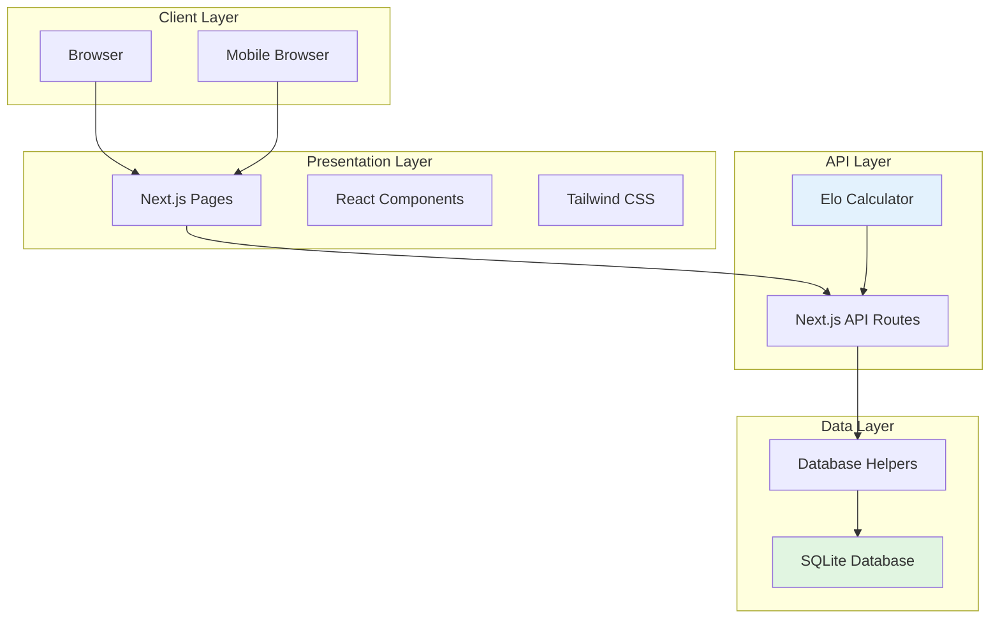
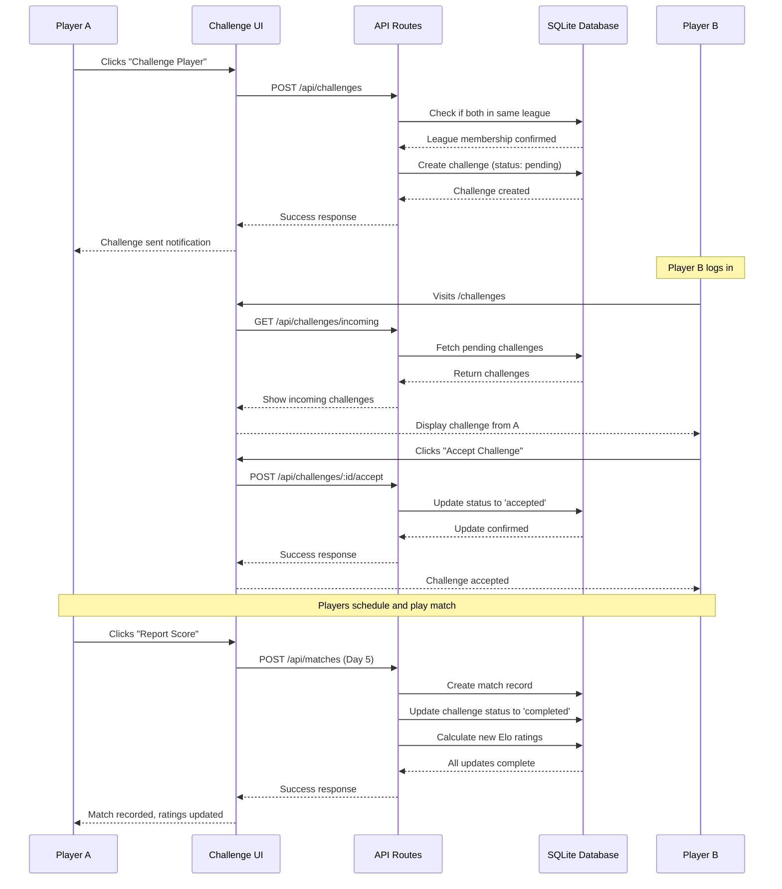
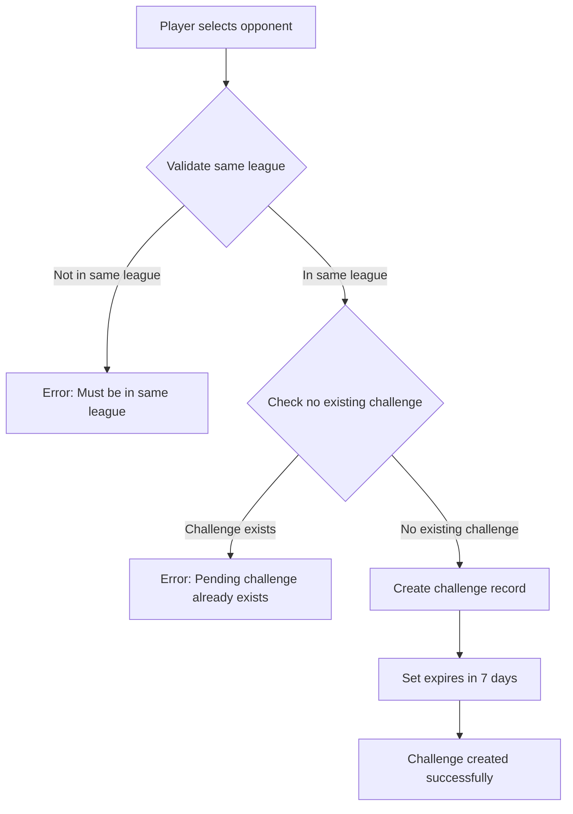
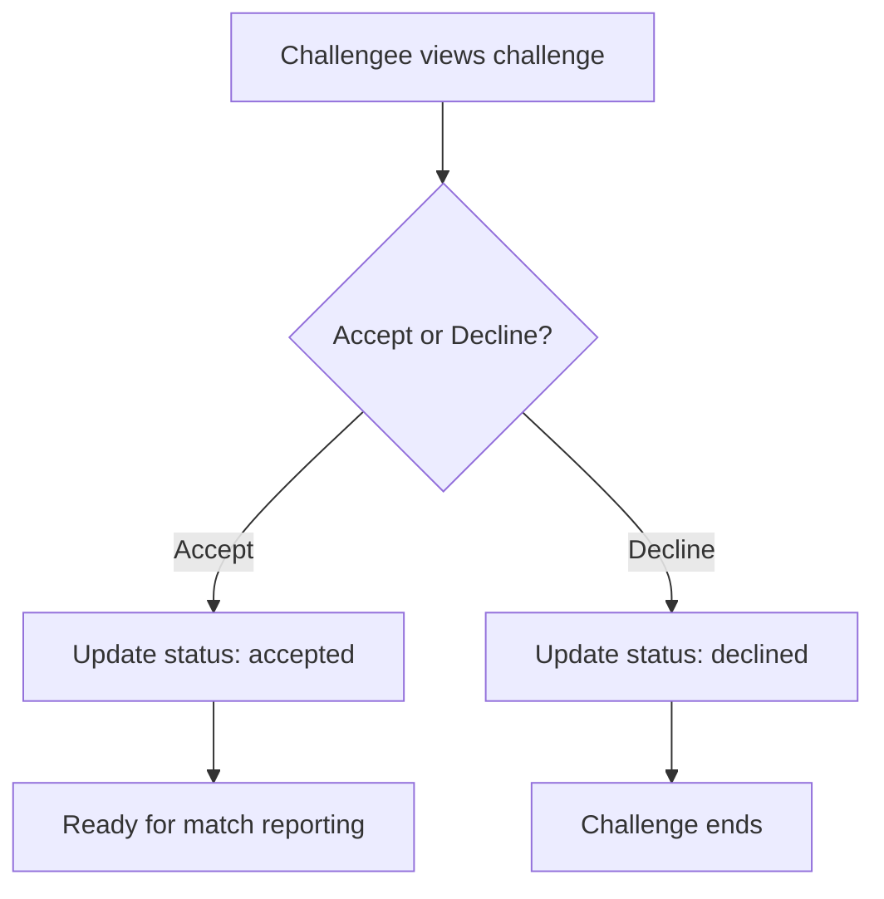
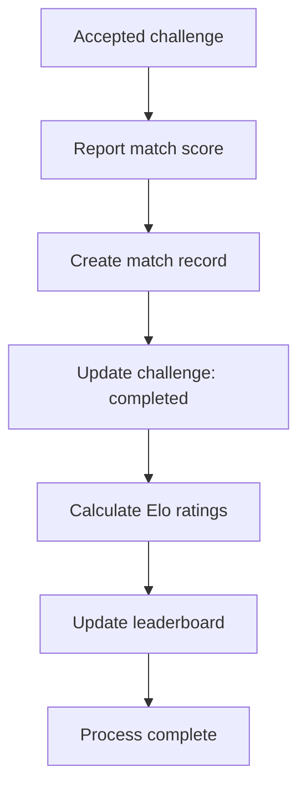
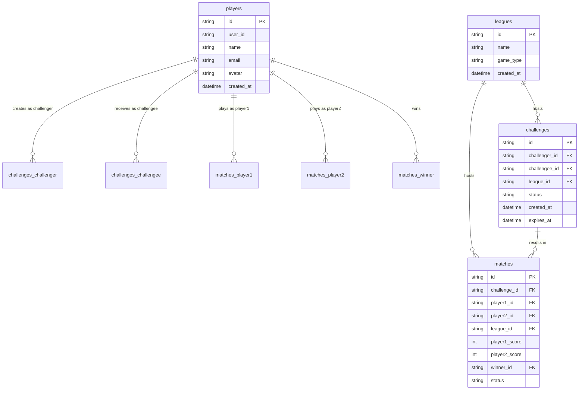
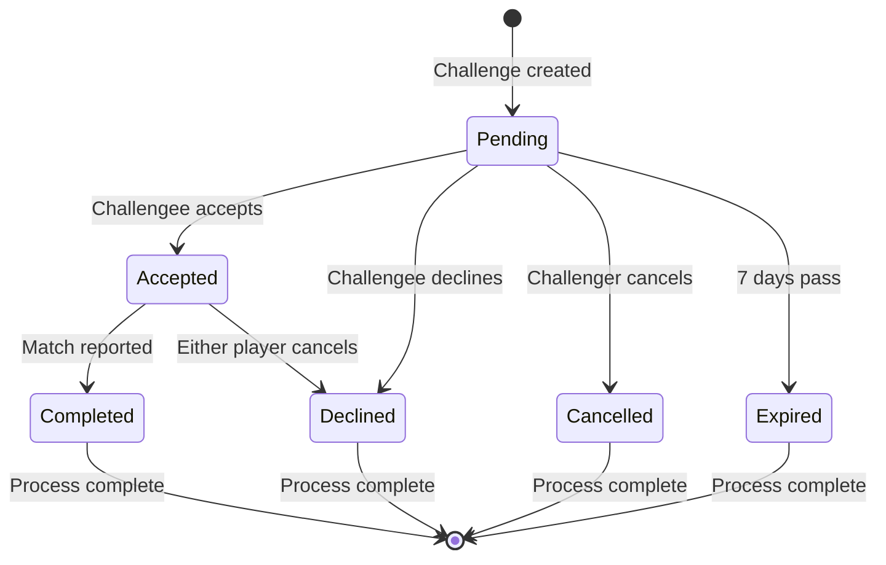

# League Ladder - Architecture Diagram

## System Architecture

## Layer Descriptions

### Client Layer
- **Browser**: Users accessing the application via traditional web browsers (Chrome, Firefox, etc.)
- **Mobile Browser**: Users accessing the application via web browsers on mobile devices

### Presentation Layer
- **Next.js Pages**: Server-rendered or statically generated pages that form the backbone of the application's frontend
- **React Components**: Reusable UI building blocks used within Next.js pages to construct the interactive user interface
- **Tailwind CSS**: Utility-first CSS framework used for styling components and pages, ensuring consistent and responsive design

### API Layer
- **Next.js API Routes**: Backend functions (serverless functions) within the Next.js framework that handle incoming HTTP requests from the Presentation Layer
- **Elo Calculator**: Business logic component responsible for calculating and updating player ratings (Elo scores) after matches

### Data Layer
- **Database Helpers**: Utility functions or modules that abstract direct interaction with the database, providing a cleaner interface for the API Layer
- **SQLite Database**: Relational database where all application data (players, leagues, challenges, matches, ratings) is stored

## Data Flow Example: Creating a Challenge

1. User on Browser/Mobile Browser navigates to a Next.js Page containing the Create Challenge Form (React Component)
2. Form fetches available Leagues and Players by making requests to Next.js API Routes (`/api/leagues`, `/api/players/available`)
3. Next.js API Routes use Database Helpers to query SQLite Database for required player and league data
4. Data is returned through API Layer to Presentation Layer, where dropdowns are populated
5. When user submits form, request is sent to Next.js API Route (`/api/challenges`) to create the challenge
6. API route interacts with Database Helpers to record the new challenge in SQLite Database
7. API responds with success or failure, displayed in Next.js Page via React Components

## Challenge Workflow

## Challenge Process Flows

### Challenge Creation Flow

### Challenge Response Flow

### Match Flow (Day 5)

## Database Schema (ERD)

## Challenge State Diagram

## State Descriptions

### Challenge States

- **Pending**: Initial state when challenge is created. Challengee can accept, decline, or let it expire.
- **Accepted**: Challenge has been accepted by challengee. Ready for match to be played and reported.
- **Completed**: Match has been played and score reported. Challenge lifecycle complete.
- **Declined**: Challenge was rejected by challengee or cancelled after acceptance.
- **Cancelled**: Challenger revoked the challenge before acceptance.
- **Expired**: Challenge was not acted upon within 7 days and automatically expired.