# League Ladder - System Architecture

**Last Updated**: January 2026  
**Version**: 1.0

---

## High-Level Architecture

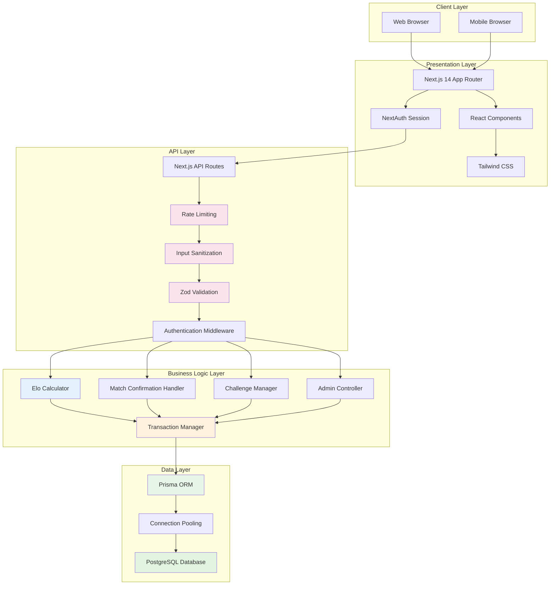

---

## Architecture Layers

### 1. Client Layer
- **Web Browser**: Desktop users accessing via Chrome, Firefox, Safari, Edge
- **Mobile Browser**: Mobile users on iOS Safari, Chrome Mobile, etc.
- **Responsive Design**: Single codebase serves all device types
- **PWA Support**: Progressive Web App capabilities for mobile installation

### 2. Presentation Layer
- **Next.js 14 App Router**: Modern React framework with server-side rendering
- **React Components**: Reusable UI components organized by feature
  - Authentication components (`src/components/auth/`)
  - Match components (`src/components/match/`)
  - League components (`src/components/league/`)
  - Player components (`src/components/player/`)
  - Admin components (`src/components/admin/`)
  - UI components (`src/components/ui/`)
- **Tailwind CSS**: Utility-first CSS framework for styling
- **NextAuth Session**: Client-side session management
- **Server Components**: Next.js server components for data fetching

### 3. API Layer
- **Next.js API Routes**: Serverless functions handling HTTP requests
- **Rate Limiting**: Protects endpoints from abuse
  - `apiRateLimit`: General API endpoints
  - `strictRateLimit`: Admin and sensitive operations
- **Input Sanitization**: Prevents injection attacks (SQL, XSS)
- **Zod Validation**: Schema-based request validation
- **Authentication Middleware**: Consistent auth checks via NextAuth
- **Admin Authorization**: Database-verified admin status checks

### 4. Business Logic Layer
- **Elo Calculator**: Rating calculation with margin of victory (K-factor: 32)
- **Match Confirmation Handler**: Two-player confirmation workflow
- **Challenge Manager**: Challenge creation, acceptance, expiration (7 days)
- **Admin Controller**: Administrative operations
  - Void/un-void matches with rating reversion
  - Adjust player ratings and stats
  - Edit match scores with rating recalculation
  - User and player management
- **Transaction Manager**: Prisma transactions for data consistency
- **Rating Reversion**: Automatic rating/stats rollback for voided matches

### 5. Data Layer
- **PostgreSQL Database**: Production-ready relational database
- **Prisma ORM**: Type-safe database access with migrations
- **Connection Pooling**: Managed by Prisma for optimal performance
- **Database Migrations**: Version-controlled schema changes
- **No Database Triggers**: All business logic in application layer

---

## System Components

### Authentication & Authorization

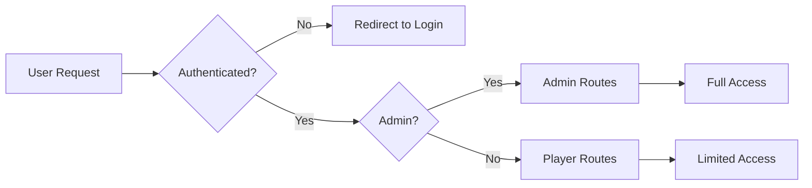

**Authentication Flow:**
1. User submits credentials (email/password)
2. NextAuth validates and creates session
3. Session stored in database (`sessions` table)
4. Protected routes check session via middleware
5. Admin routes verify `isAdmin` flag from database (not just session)

### Security Features

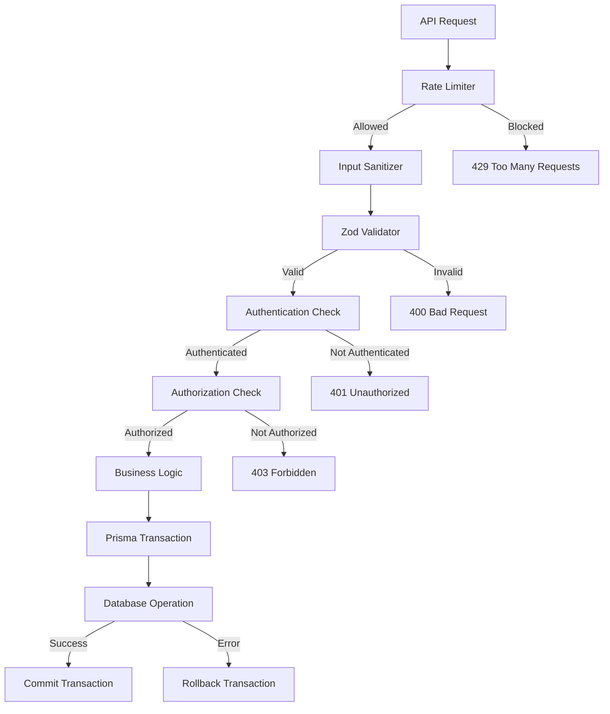

**Security Layers:**
1. **Rate Limiting**: Multiple limiters for different endpoints
   - `apiRateLimit`: General API endpoints
   - `strictRateLimit`: Admin and sensitive operations
   - Prevents brute force and DoS attacks

2. **Input Sanitization**: 
   - `sanitizeString()`: Removes dangerous characters
   - `sanitizeEmail()`: Email validation and sanitization
   - `sanitizeUUID()`: UUID format validation
   - Prevents SQL injection and XSS attacks

3. **Validation**:
   - Zod schemas for all API requests
   - Type-safe validation at runtime
   - Clear error messages for invalid input

4. **Transactions**:
   - Prisma `$transaction()` for atomic operations
   - Automatic rollback on errors
   - Ensures data consistency

---

## Database Schema

### Entity-Relationship Diagram

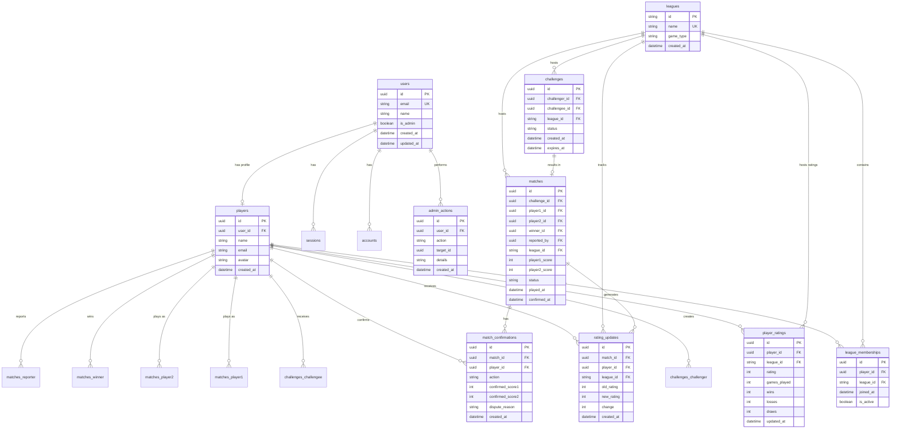

### Key Relationships

- **Users → Players**: One-to-many (each user can have multiple player profiles, though typically one)
- **Players → Leagues**: Many-to-many (via `league_memberships`)
- **Players → Ratings**: One-to-many per league (via `player_ratings`)
- **Challenges → Matches**: One-to-one (each challenge can result in one match)
- **Matches → Confirmations**: One-to-many (one confirmation per participant)
- **Matches → Rating Updates**: One-to-many (one update per player per match)
- **Users → Admin Actions**: One-to-many (audit trail for admin operations)

### Match Status Flow

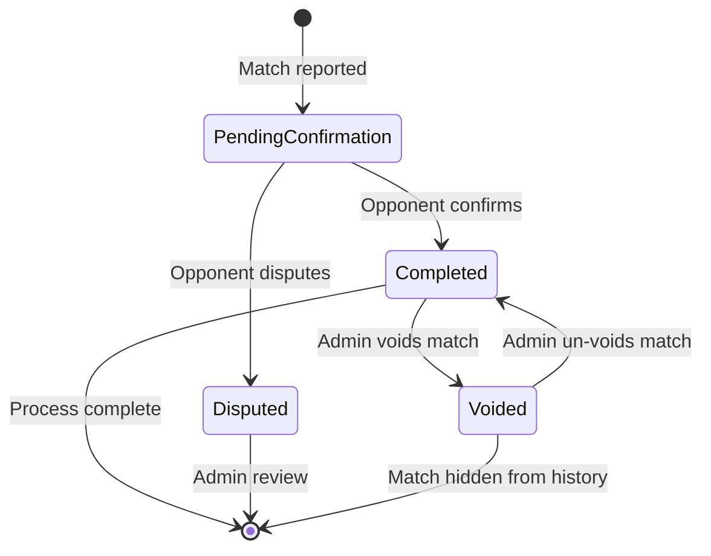

---

## API Architecture

### API Route Structure

```
/api
├── /auth/[...nextauth]          # NextAuth authentication
├── /health                      # Health check endpoint
│
├── /leagues                     # League operations
│   ├── GET                      # List all leagues
│   ├── POST /join               # Join a league
│   └── /[leagueId]
│       ├── GET /membership      # Check membership
│       ├── GET /stats           # League statistics
│       ├── GET /matches         # League match history
│       └── GET /matches/count   # Match count
│
├── /challenges                  # Challenge management
│   ├── GET                      # List all challenges
│   ├── POST                     # Create challenge
│   ├── GET /incoming            # Get incoming challenges
│   ├── GET /outgoing            # Get outgoing challenges
│   └── /[challengeId]
│       ├── POST /accept         # Accept challenge
│       ├── POST /decline        # Decline challenge
│       └── POST /cancel         # Cancel challenge
│
├── /matches                     # Match operations
│   ├── GET                      # List matches
│   ├── POST                     # Report match
│   ├── GET /history             # Match history with ratings
│   ├── GET /pending-confirmations # Pending confirmations
│   ├── GET /pending-count       # Count of pending items
│   ├── GET /count               # Total match count
│   ├── POST /from-challenge/[id] # Report from challenge
│   └── /[matchId]
│       ├── GET                  # Get match details
│       ├── PUT                  # Update match (admin)
│       ├── DELETE               # Delete match (admin)
│       └── POST /confirm        # Confirm/dispute match
│
├── /leaderboard/[leagueId]      # Get league leaderboard
│
├── /players                     # Player operations
│   ├── GET /available           # Get available players
│   ├── GET /me                  # Get current player
│   └── /[playerId]
│       ├── GET                  # Get player details
│       ├── GET /matches         # Get player matches
│       └── GET /rating-history  # Get rating history
│
├── /user                        # User operations
│   ├── GET /stats               # User statistics
│   └── GET /onboarding-status   # Check onboarding
│
└── /admin                       # Admin operations
    ├── GET /stats               # System statistics
    ├── GET /users               # List all users
    ├── GET /users/[userId]      # Get user details
    ├── POST /users/[userId]/toggle-admin # Toggle admin
    ├── DELETE /users/[userId]   # Delete user
    ├── GET /players             # List all players
    ├── GET /players/[playerId]  # Get player details
    ├── DELETE /players/[playerId] # Delete player
    ├── PUT /players/[playerId]/ratings/[leagueId] # Adjust rating
    ├── PUT /players/[playerId]/stats/[leagueId] # Adjust stats
    ├── GET /matches             # List all matches
    ├── PUT /matches/[matchId]   # Edit match scores
    ├── POST /matches/[matchId]/void # Void match
    ├── POST /matches/[matchId]/unvoid # Un-void match
    ├── DELETE /matches/[matchId] # Delete match
    ├── GET /leagues             # List all leagues
    ├── GET /db/cleanup          # Preview cleanup
    └── POST /db/cleanup         # Perform cleanup
```

### API Request Flow

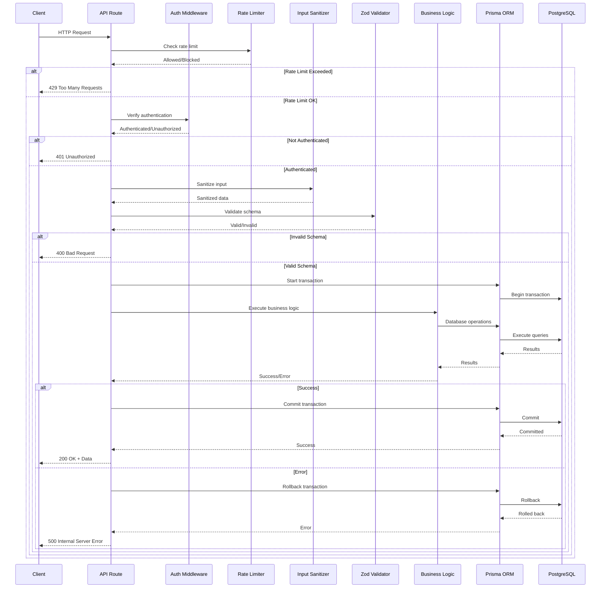

---

## Match Confirmation Flow

### Complete Match Lifecycle

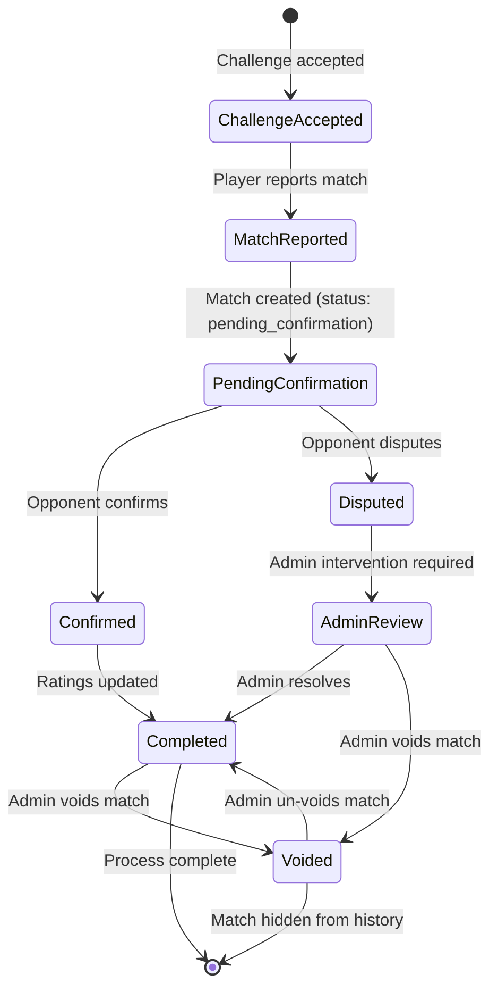

### Match Confirmation Sequence

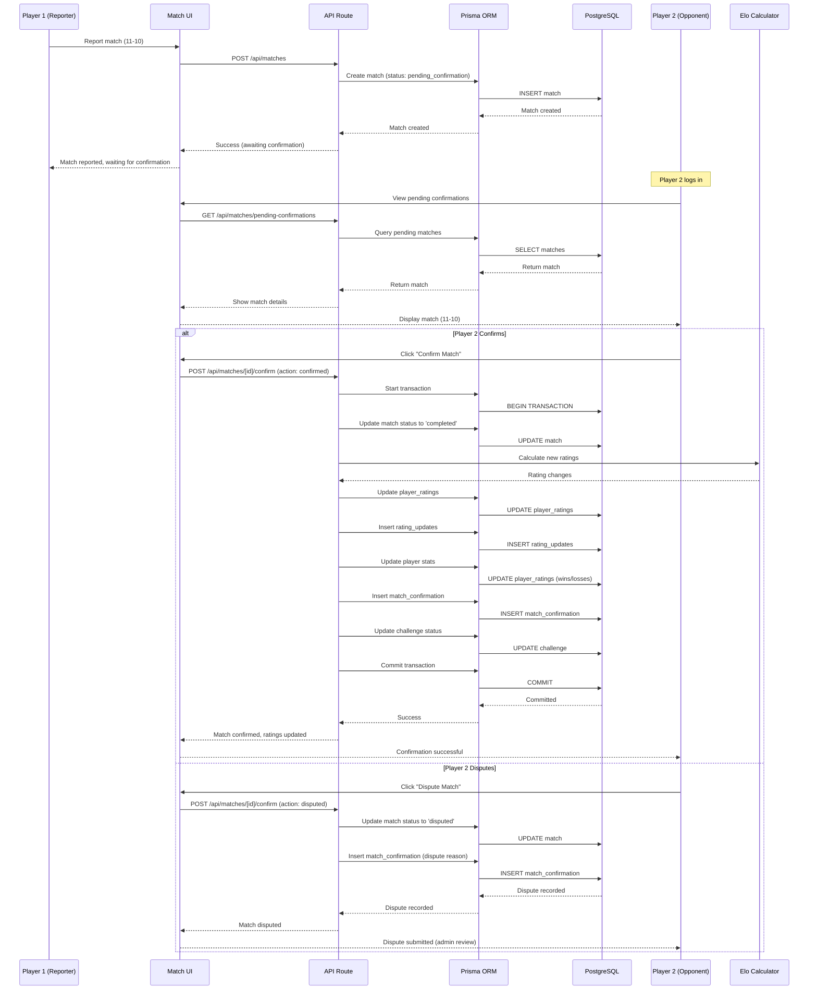

---

## Challenge Workflow

### Challenge State Machine

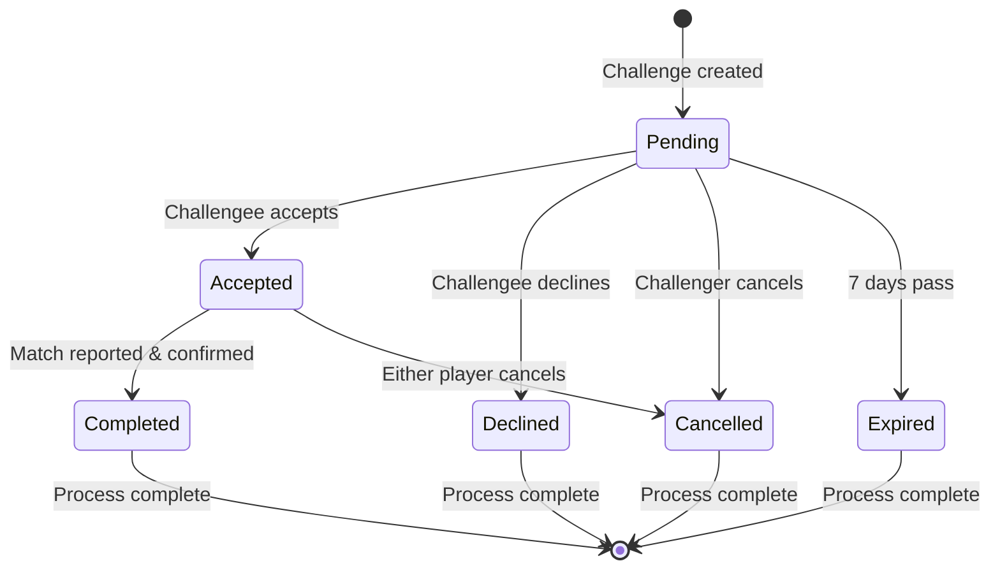

### Challenge Creation Flow

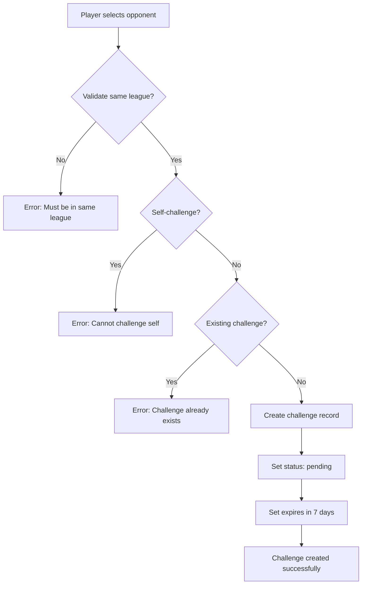

---

## Elo Rating System Integration

### Rating Update Flow

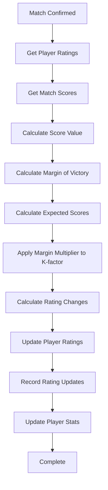

### Rating Reversion Flow (Void Match)

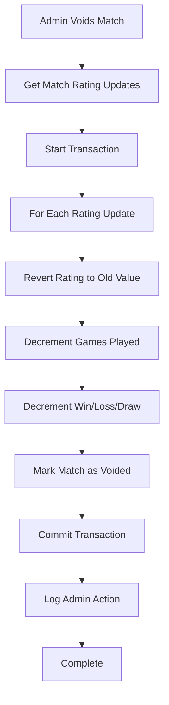

### Rating Recalculation Flow (Un-void Match)

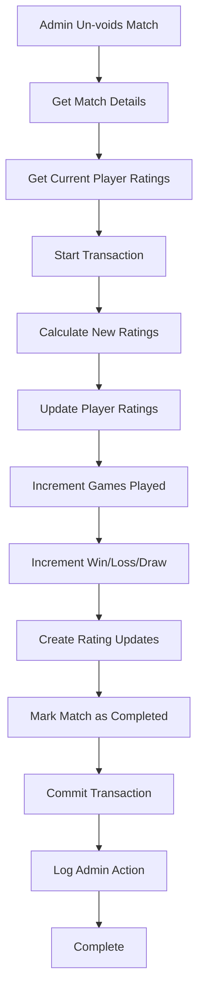

---

## Admin System

### Admin Capabilities

```mermaid
graph TB
    A[Admin User] --> B[System Statistics]
    A --> C[User Management]
    A --> D[Player Management]
    A --> E[Match Management]
    A --> F[League Management]
    A --> G[Database Cleanup]
    
    B --> B1[View System Stats]
    B --> B2[View Activity Logs]
    
    C --> C1[List All Users]
    C --> C2[Toggle Admin Status]
    C --> C3[View User Details]
    C --> C4[Delete Users]
    
    D --> D1[List All Players]
    D --> D2[View Player Stats]
    D --> D3[Adjust Ratings]
    D --> D4[Adjust Stats]
    D --> D5[Delete Players]
    
    E --> E1[View All Matches]
    E --> E2[Void Matches]
    E --> E3[Un-void Matches]
    E --> E4[Edit Match Scores]
    E --> E5[Delete Matches]
    
    F --> F1[View Leagues]
    F --> F2[View League Stats]
    
    G --> G1[Preview Cleanup]
    G --> G2[Perform Cleanup]
```

### Admin Action Flow

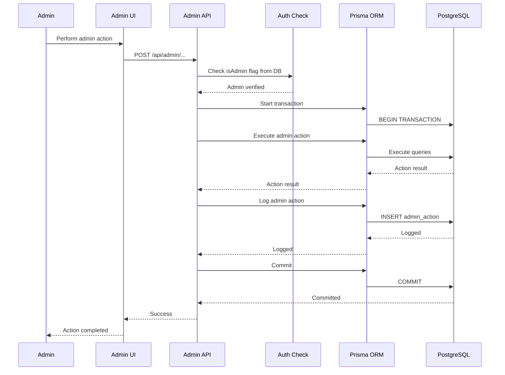

### Admin Action Types

- `void_match`: Void a match and revert ratings
- `unvoid_match`: Restore a voided match and recalculate ratings
- `edit_match_score`: Edit match scores and recalculate ratings
- `adjust_rating`: Manually adjust a player's rating
- `adjust_stats`: Manually adjust a player's stats
- `toggle_admin`: Grant or revoke admin status
- `delete_user`: Delete a user account
- `delete_player`: Delete a player profile
- `delete_match`: Permanently delete a match

---

## Data Flow Examples

### Example 1: Reporting a Match

1. **Player A** reports match result (21-15) via UI
2. **UI** sends `POST /api/matches` with scores
3. **API Route** validates request (rate limit, auth, sanitize, validate)
4. **Prisma** creates match record with `status: 'pending_confirmation'`
5. **API** returns success to UI
6. **UI** shows "Match reported, awaiting opponent confirmation"
7. **Player B** logs in and sees pending confirmation
8. **Player B** confirms match
9. **API** updates match status to `'completed'`
10. **Elo Calculator** calculates new ratings
11. **Prisma** updates player ratings and stats
12. **Prisma** records rating updates
13. **Leaderboard** updates automatically

### Example 2: Challenge to Match Flow

1. **Player A** creates challenge for **Player B** in Table Tennis league
2. **Prisma** creates challenge record (`status: 'pending'`)
3. **Player B** accepts challenge
4. **Prisma** updates challenge (`status: 'accepted'`)
5. **Players** play match
6. **Player A** reports match (11-9)
7. **Prisma** creates match linked to challenge (`status: 'pending_confirmation'`)
8. **Player B** confirms match
9. **Prisma** updates match to `'completed'`
10. **Elo Calculator** calculates new ratings
11. **Prisma** updates player stats and ratings
12. **Leaderboard** reflects new rankings

### Example 3: Admin Voiding a Match

1. **Admin** views match in admin panel
2. **Admin** clicks "Void Match"
3. **API** receives `POST /api/admin/matches/[id]/void`
4. **Prisma** starts transaction
5. **Prisma** fetches match and rating updates
6. **Prisma** reverts each player's rating to old value
7. **Prisma** decrements games played, wins/losses/draws
8. **Prisma** marks match as `'voided'`
9. **Prisma** commits transaction
10. **Prisma** logs admin action
11. **Match** is now hidden from player match history
12. **Ratings** are reverted to pre-match values

---

## Technology Stack

### Frontend
- **Next.js 14**: React framework with App Router
- **TypeScript**: Type-safe development
- **Tailwind CSS**: Utility-first styling
- **React Hook Form**: Form management
- **Zod**: Runtime validation
- **NextAuth.js**: Authentication

### Backend
- **Next.js API Routes**: Serverless functions
- **Prisma ORM**: Type-safe database access
- **PostgreSQL**: Production database
- **Zod**: Request validation
- **crypto**: Password hashing (via NextAuth)

### Database
- **PostgreSQL**: Production-ready relational database
- **Prisma Migrations**: Version-controlled schema changes
- **Foreign Keys**: Referential integrity
- **Transactions**: Atomic operations via Prisma

### Security
- **Rate Limiting**: Multiple rate limiters
- **Input Sanitization**: XSS and SQL injection prevention
- **Zod Validation**: Schema-based validation
- **Transaction Support**: Atomic operations with rollback
- **Admin Action Logging**: Audit trail for all admin operations

### Testing
- **Jest**: Test runner
- **React Testing Library**: Component testing
- **ts-jest**: TypeScript support

---

## Deployment Architecture

### Vercel Deployment

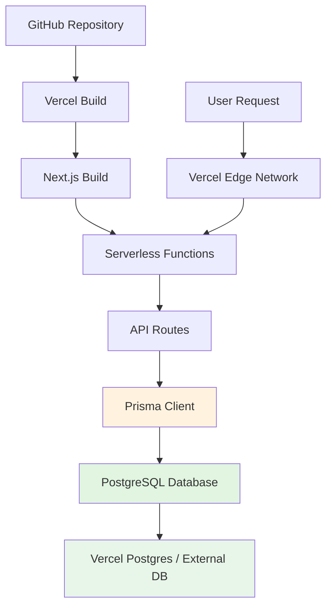

**Deployment Details:**
- **Hosting**: Vercel (serverless deployment)
- **Database**: PostgreSQL (Vercel Postgres or external provider)
- **Build**: Next.js production build
- **Runtime**: Node.js serverless functions
- **Edge Network**: Global CDN for static assets

### Production Considerations

1. **Database**: PostgreSQL for persistence and scalability
2. **Connection Pooling**: Managed by Prisma for optimal performance
3. **CDN**: Static assets served via Vercel Edge Network
4. **Monitoring**: Error tracking and performance monitoring
5. **Backup**: Automated database backups for production data
6. **Environment Variables**: Secure configuration management

---

## Performance Optimizations

1. **Prisma Connection Pooling**: Efficient database connection management
2. **Transaction Batching**: Multiple operations in single transaction
3. **Rate Limiting**: Prevents abuse and ensures fair resource usage
4. **Input Validation**: Early rejection of invalid requests
5. **Server Components**: Server-side rendering for better performance
6. **Lazy Loading**: Components loaded on demand
7. **Database Indexes**: Optimized queries via Prisma schema

---

## Security Architecture

### Defense in Depth

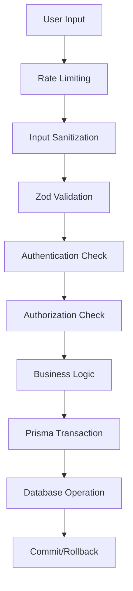

**Security Layers:**
1. **Rate Limiting**: Prevents brute force and DoS
2. **Input Sanitization**: Removes dangerous characters
3. **Validation**: Ensures data format correctness
4. **Authentication**: Verifies user identity via NextAuth
5. **Authorization**: Checks user permissions (admin status from DB)
6. **Transactions**: Ensures data consistency
7. **Parameterized Queries**: Prisma prevents SQL injection
8. **Admin Action Logging**: Audit trail for accountability

---

## Component Architecture

### Component Organization

```
src/components/
├── admin/              # Admin-specific components
│   └── admin-panel.tsx
├── auth/               # Authentication components
│   ├── auth-button.tsx
│   └── auth-provider.tsx
├── challenge/          # Challenge components
│   ├── challenge-card.tsx
│   └── create-challenge-form.tsx
├── league/             # League components
│   └── league-match-history.tsx
├── match/              # Match components
│   ├── match-confirmation-card.tsx
│   ├── match-history.tsx
│   ├── match-report-form.tsx
│   └── pending-confirmations.tsx
├── player/             # Player components
│   ├── player-match-history.tsx
│   ├── player-profile.tsx
│   └── rating-history.tsx
├── ui/                 # Reusable UI components
│   ├── button.tsx
│   ├── card.tsx
│   ├── form-modal.tsx
│   ├── confirmation-dialog.tsx
│   └── ...
└── layout/             # Layout components
    └── navigation.tsx
```

---

## Summary

The League Ladder architecture follows a **layered, security-first approach**:

- ✅ **Separation of Concerns**: Clear boundaries between layers
- ✅ **Security at Every Layer**: Multiple security checks
- ✅ **Data Consistency**: Prisma transactions ensure integrity
- ✅ **Scalable Design**: Serverless architecture ready for growth
- ✅ **Type Safety**: TypeScript and Prisma throughout the stack
- ✅ **Testability**: Clear interfaces for testing
- ✅ **Admin Audit Trail**: All admin actions logged
- ✅ **Production Ready**: PostgreSQL for persistence and scalability

The system is designed to be **maintainable, secure, and scalable** while providing a smooth user experience for competitive league management.

---

**Last Updated**: January 2026  
**Document Version**: 2.0
