# League Ladder - System Architecture

## High-Level Architecture

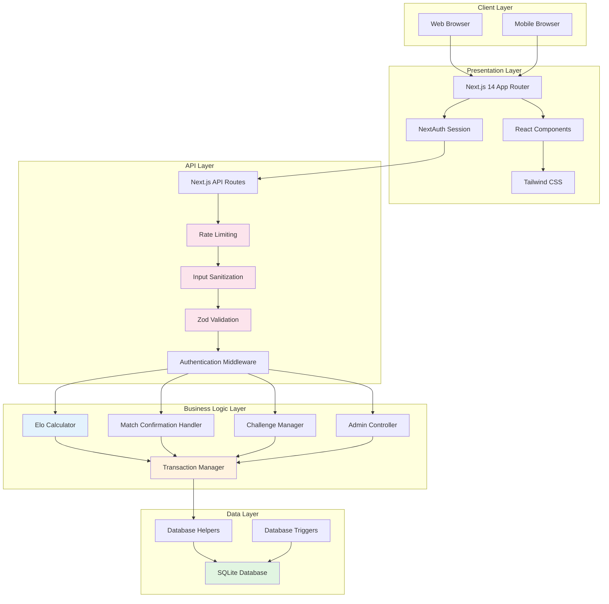

## Architecture Layers

### 1. Client Layer
- **Web Browser**: Desktop users accessing via Chrome, Firefox, Safari, Edge
- **Mobile Browser**: Mobile users on iOS Safari, Chrome Mobile, etc.
- **Responsive Design**: Single codebase serves all device types

### 2. Presentation Layer
- **Next.js 14 App Router**: Modern React framework with server-side rendering
- **React Components**: Reusable UI components organized by feature
  - Authentication components (`src/components/auth/`)
  - Match components (`src/components/match/`)
  - League components (`src/components/league/`)
  - UI components (`src/components/ui/`)
- **Tailwind CSS**: Utility-first CSS framework for styling
- **NextAuth Session**: Client-side session management

### 3. API Layer
- **Next.js API Routes**: Serverless functions handling HTTP requests
- **Rate Limiting**: Protects endpoints from abuse (multiple rate limiters)
- **Input Sanitization**: Prevents injection attacks (SQL, XSS)
- **Zod Validation**: Schema-based request validation
- **Authentication Middleware**: `createProtectedHandler` for consistent auth checks

### 4. Business Logic Layer
- **Elo Calculator**: Rating calculation with margin of victory
- **Match Confirmation Handler**: Two-player confirmation workflow
- **Challenge Manager**: Challenge creation, acceptance, expiration
- **Admin Controller**: Administrative operations (void matches, manage players)
- **Transaction Manager**: Database transactions with backup/rollback

### 5. Data Layer
- **SQLite Database**: File-based relational database (better-sqlite3)
- **Database Helpers**: Abstraction layer for database operations
- **Database Triggers**: Automatic rating updates, challenge status changes

---

## System Components

### Authentication & Authorization

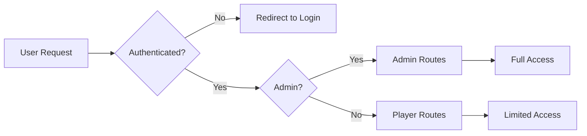

**Authentication Flow:**
1. User submits credentials (email/password)
2. NextAuth validates and creates session
3. Session stored in database (`sessions` table)
4. Protected routes check session via middleware
5. Admin routes require `is_admin = true` flag

### Security Features

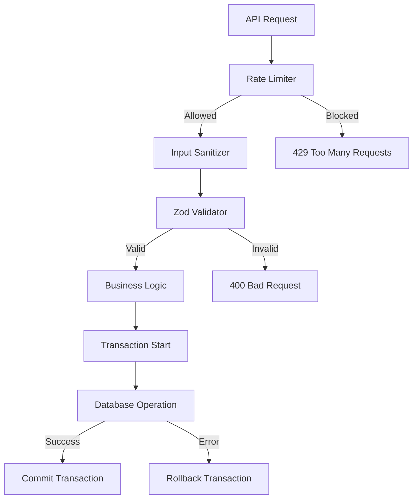

**Security Layers:**
1. **Rate Limiting**: Multiple limiters for different endpoints
   - `authRateLimit`: Authentication endpoints
   - `apiRateLimit`: General API endpoints
   - `strictRateLimit`: Sensitive operations
   - `loginRateLimit`: Login attempts
   - `registerRateLimit`: Registration attempts

2. **Input Sanitization**: 
   - `sanitizeString()`: Removes dangerous characters
   - `sanitizeEmail()`: Email validation and sanitization
   - `sanitizeUUID()`: UUID format validation
   - Prevents SQL injection and XSS attacks

3. **Validation**:
   - Zod schemas for all API requests
   - Type-safe validation at runtime
   - Clear error messages for invalid input

4. **Transactions**:
   - `createBackup()`: Database backup before operations
   - `restoreBackup()`: Rollback on errors
   - Ensures data consistency

---

## Database Schema

### Entity-Relationship Diagram

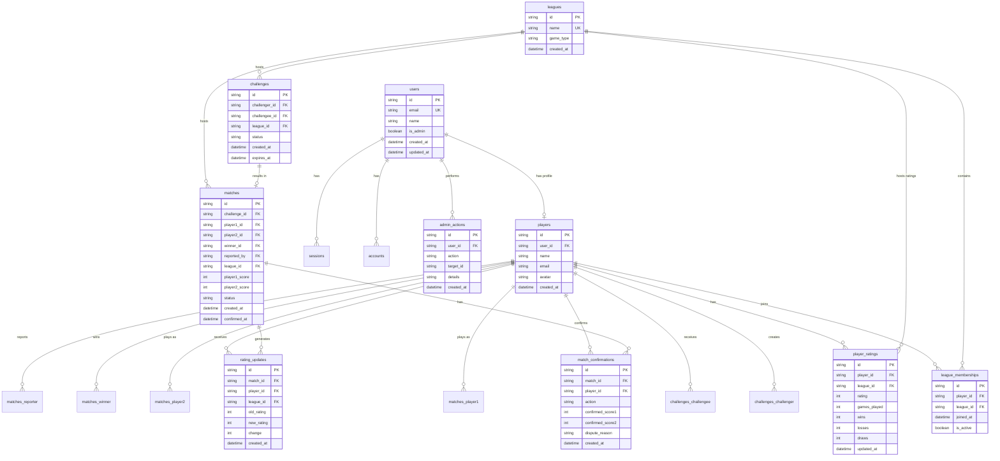

### Key Relationships

- **Users → Players**: One-to-one (each user has one player profile)
- **Players → Leagues**: Many-to-many (via `league_memberships`)
- **Players → Ratings**: One-to-many per league (via `player_ratings`)
- **Challenges → Matches**: One-to-one (each challenge can result in one match)
- **Matches → Confirmations**: One-to-many (one confirmation per participant)
- **Matches → Rating Updates**: One-to-many (one update per player per match)

---

## API Architecture

### API Route Structure

```
/api
├── /auth/[...nextauth]          # NextAuth authentication
├── /health                      # Health check endpoint
│
├── /leagues                     # League operations
│   ├── GET                      # List all leagues
│   └── /[leagueId]/matches     # Get league matches
│
├── /challenges                  # Challenge management
│   ├── GET                      # List challenges
│   ├── POST                     # Create challenge
│   ├── /incoming                # Get incoming challenges
│   └── /outgoing                # Get outgoing challenges
│
├── /matches                     # Match operations
│   ├── GET                      # List matches
│   ├── POST                     # Report match
│   ├── /pending-confirmations   # Get pending confirmations
│   ├── /pending-count           # Get count of pending items
│   ├── /from-challenge/[id]     # Report match from challenge
│   └── /[matchId]
│       ├── GET                  # Get match details
│       └── /confirm             # Confirm/dispute match
│
├── /leaderboard/[leagueId]      # Get league leaderboard
│
├── /players                     # Player operations
│   ├── /available               # Get available players
│   ├── /me                      # Get current player
│   └── /[playerId]
│       ├── /matches             # Get player matches
│       └── /rating-history      # Get rating history
│
└── /admin                       # Admin operations
    ├── /stats                   # System statistics
    ├── /users                   # User management
    ├── /players                 # Player management
    ├── /matches                 # Match management
    └── /leagues                 # League management
```

### API Request Flow

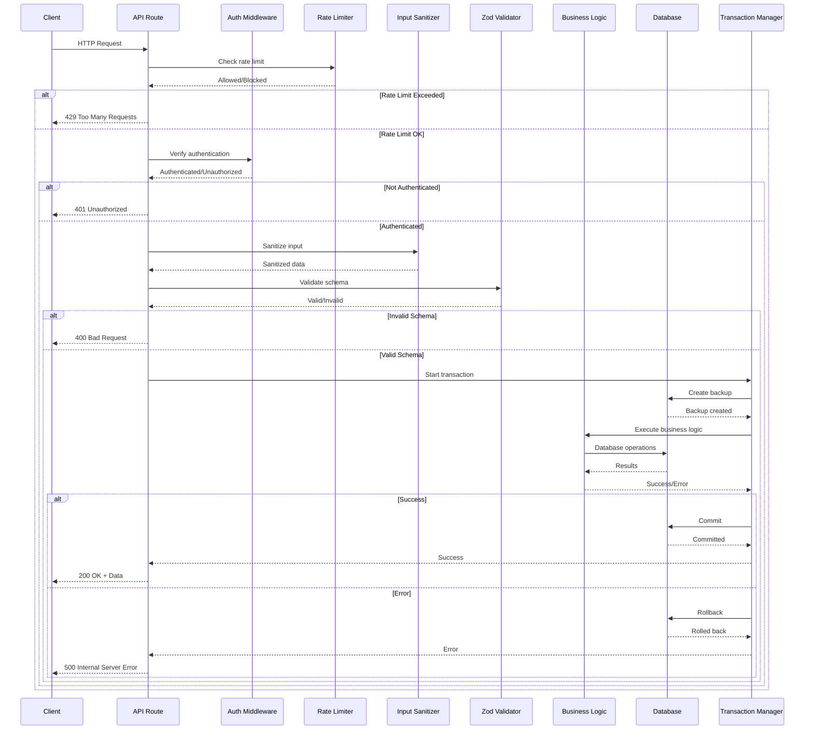

---

## Match Confirmation Flow

### Complete Match Lifecycle

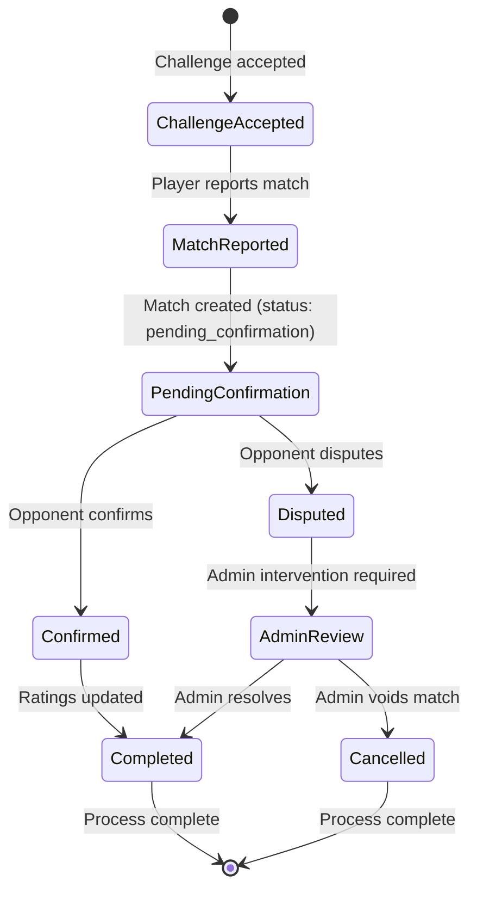

### Match Confirmation Sequence

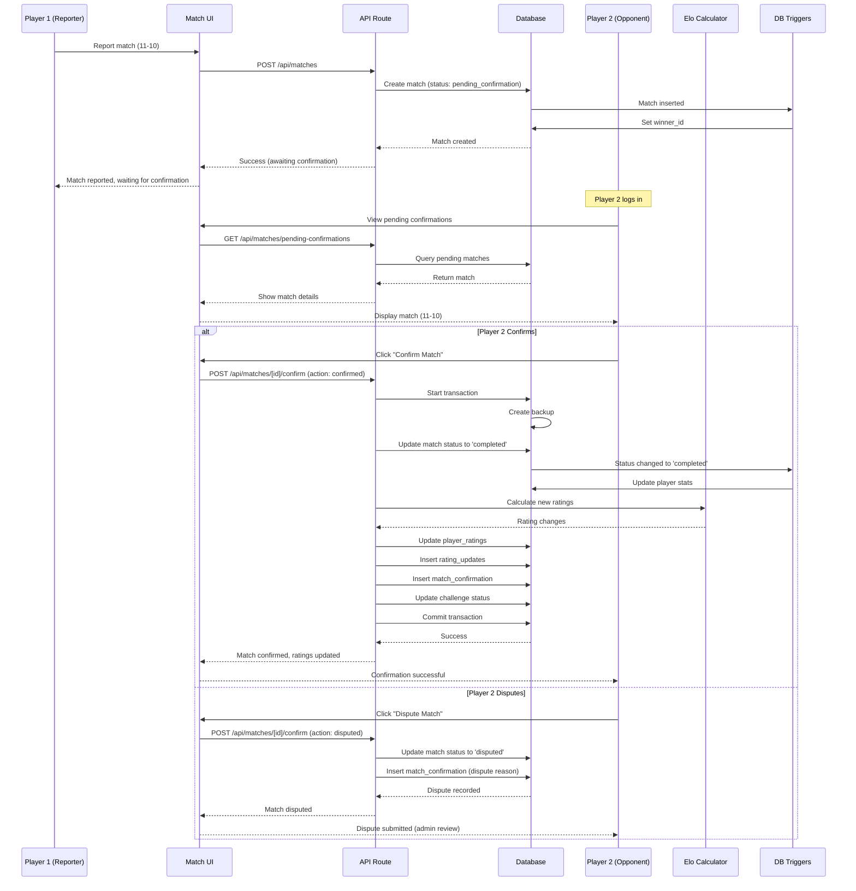

---

## Challenge Workflow

### Challenge State Machine

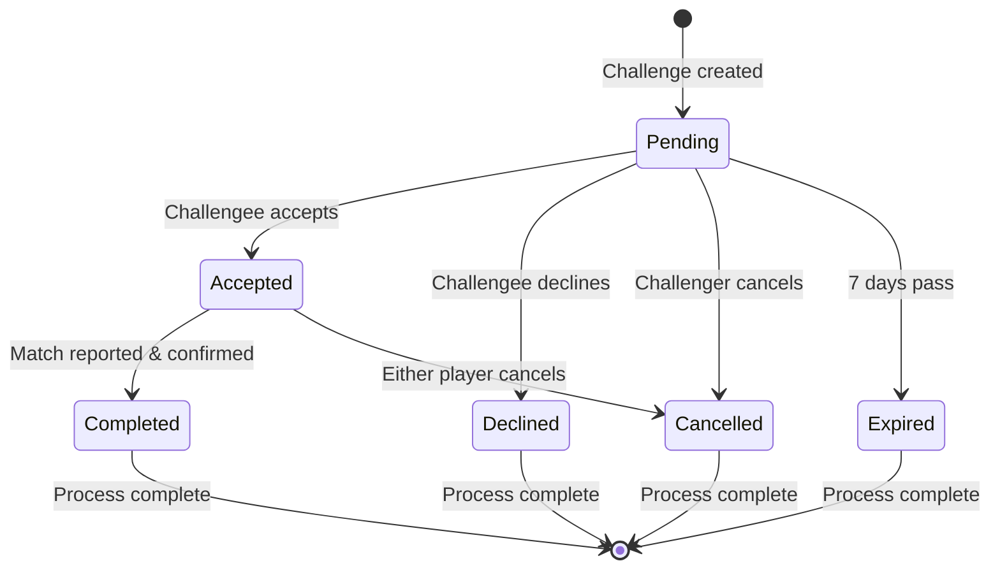

### Challenge Creation Flow

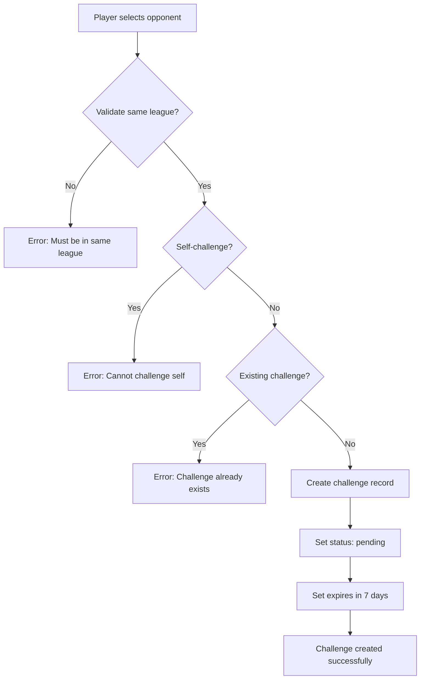

---

## Elo Rating System Integration

### Rating Update Flow

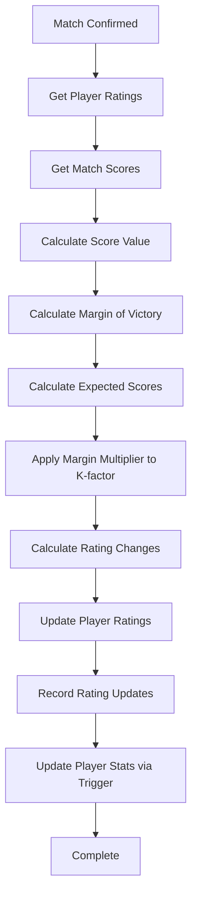

### Database Triggers

The system uses SQLite triggers for automatic updates:

1. **`set_match_winner_on_insert`**: Sets `winner_id` when match is inserted
2. **`set_match_winner`**: Sets `winner_id` when status changes to 'completed'
3. **`update_challenge_on_match_creation`**: Updates challenge status to 'completed' when match is created
4. **`update_player_stats_on_match_insert`**: Updates player stats when match is inserted with 'completed' status
5. **`update_player_stats_on_match_update`**: Updates player stats when match status changes to 'completed'

---

## Admin System

### Admin Capabilities

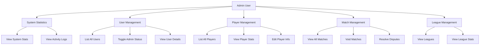

### Admin Action Flow

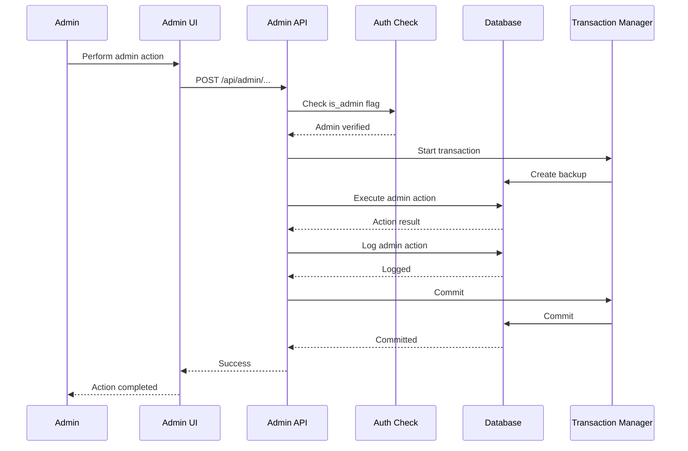

---

## Data Flow Examples

### Example 1: Reporting a Match

1. **Player A** reports match result (21-15) via UI
2. **UI** sends `POST /api/matches` with scores
3. **API Route** validates request (rate limit, auth, sanitize, validate)
4. **Database** creates match record with `status: 'pending_confirmation'`
5. **Trigger** sets `winner_id` automatically
6. **API** returns success to UI
7. **UI** shows "Match reported, awaiting opponent confirmation"
8. **Player B** logs in and sees pending confirmation
9. **Player B** confirms match
10. **API** updates match status to `'completed'`
11. **Trigger** updates player stats
12. **Elo Calculator** calculates new ratings
13. **Database** records rating updates
14. **Leaderboard** updates automatically

### Example 2: Challenge to Match Flow

1. **Player A** creates challenge for **Player B** in Table Tennis league
2. **Database** creates challenge record (`status: 'pending'`)
3. **Player B** accepts challenge
4. **Database** updates challenge (`status: 'accepted'`)
5. **Players** play match
6. **Player A** reports match (11-9)
7. **Database** creates match linked to challenge (`status: 'pending_confirmation'`)
8. **Trigger** updates challenge to `'completed'`
9. **Player B** confirms match
10. **Database** updates match to `'completed'`
11. **Triggers** update player stats and ratings
12. **Leaderboard** reflects new rankings

---

## Technology Stack

### Frontend
- **Next.js 14**: React framework with App Router
- **TypeScript**: Type-safe development
- **Tailwind CSS**: Utility-first styling
- **React Hook Form**: Form management
- **Zod**: Runtime validation
- **NextAuth.js**: Authentication

### Backend
- **Next.js API Routes**: Serverless functions
- **better-sqlite3**: SQLite database driver
- **Zod**: Request validation
- **crypto**: Password hashing (via NextAuth)

### Database
- **SQLite**: File-based relational database
- **Triggers**: Automatic data consistency
- **Foreign Keys**: Referential integrity
- **Transactions**: Atomic operations

### Security
- **Rate Limiting**: Multiple rate limiters
- **Input Sanitization**: XSS and SQL injection prevention
- **Zod Validation**: Schema-based validation
- **Transaction Support**: Backup/rollback mechanism

### Testing
- **Jest**: Test runner
- **React Testing Library**: Component testing
- **ts-jest**: TypeScript support

---

## Deployment Architecture

### Vercel Deployment

```mermaid
graph TB
    A[GitHub Repository] --> B[Vercel Build]
    B --> C[Next.js Build]
    C --> D[Serverless Functions]
    D --> E[API Routes]
    E --> F[SQLite Database]
    F --> G[/tmp/ directory]
    
    H[User Request] --> I[Vercel Edge Network]
    I --> D
    
    style F fill:#ffebee
    style G fill:#ffebee
```

**Note**: SQLite on Vercel uses ephemeral storage (`/tmp/`), so data resets on each deployment. For production, consider migrating to PostgreSQL or another persistent database.

### Production Considerations

1. **Database**: Migrate from SQLite to PostgreSQL for persistence
2. **Caching**: Implement Redis for rate limiting and session storage
3. **CDN**: Static assets served via Vercel Edge Network
4. **Monitoring**: Add error tracking (Sentry) and analytics
5. **Backup**: Automated database backups for production data

---

## Performance Optimizations

1. **Lazy Database Initialization**: Database only initializes on first access
2. **Database Triggers**: Automatic updates reduce application logic
3. **Transaction Batching**: Multiple operations in single transaction
4. **Rate Limiting**: Prevents abuse and ensures fair resource usage
5. **Input Validation**: Early rejection of invalid requests

---

## Security Architecture

### Defense in Depth

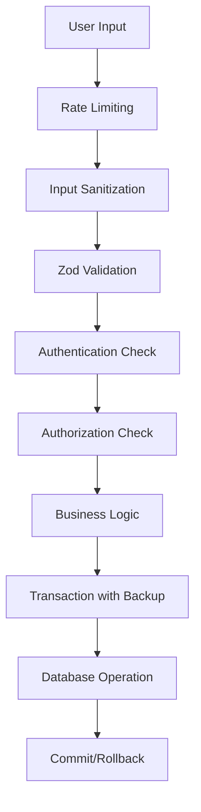

**Security Layers:**
1. **Rate Limiting**: Prevents brute force and DoS
2. **Input Sanitization**: Removes dangerous characters
3. **Validation**: Ensures data format correctness
4. **Authentication**: Verifies user identity
5. **Authorization**: Checks user permissions
6. **Transactions**: Ensures data consistency
7. **Parameterized Queries**: Prevents SQL injection

---

## Summary

The League Ladder architecture follows a **layered, security-first approach**:

- ✅ **Separation of Concerns**: Clear boundaries between layers
- ✅ **Security at Every Layer**: Multiple security checks
- ✅ **Data Consistency**: Transactions and triggers ensure integrity
- ✅ **Scalable Design**: Serverless architecture ready for growth
- ✅ **Type Safety**: TypeScript throughout the stack
- ✅ **Testability**: Clear interfaces for testing

The system is designed to be **maintainable, secure, and scalable** while providing a smooth user experience for competitive league management.
