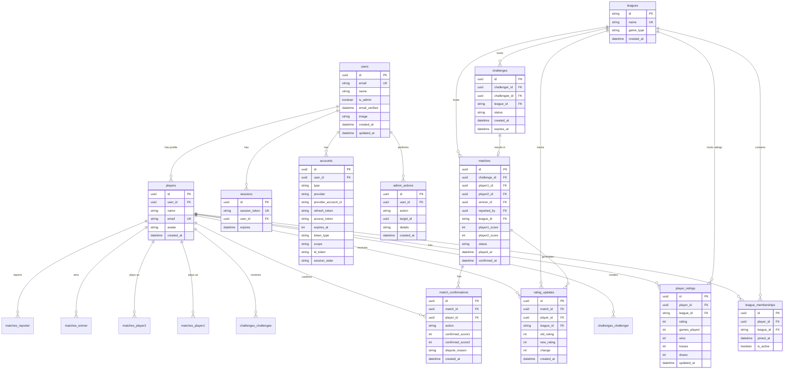

# League Ladder Data Model

This document describes the database schema, entities, and relationships for the League Ladder application.

**Last Updated**: January 2026  
**Database**: PostgreSQL with Prisma ORM

---

## Entity-Relationship Diagram (ERD)

---

## Entity Descriptions

### Authentication Entities (NextAuth.js)

#### 1. **users**
Represents authenticated users in the system. Managed by NextAuth.js.

**Attributes:**
- `id` (uuid, Primary Key) - Unique identifier for each user
- `email` (string, Unique Key) - User's email address (used for authentication)
- `name` (string, Optional) - User's display name
- `is_admin` (boolean) - Whether the user has admin privileges (default: false)
- `email_verified` (datetime, Optional) - Timestamp when email was verified
- `image` (string, Optional) - URL to user's profile image
- `created_at` (datetime) - Timestamp when the user account was created
- `updated_at` (datetime) - Timestamp when the user record was last updated

**Relationships:**
- Has zero or many `players` (user profiles)
- Has zero or many `sessions` (active sessions)
- Has zero or many `accounts` (OAuth accounts)
- Performs zero or many `admin_actions` (admin operations)

**Notes:**
- One user can have multiple player profiles (though typically one)
- Admin status is stored here, not in the player table
- Email is the primary authentication identifier

---

#### 2. **accounts**
Stores OAuth account information for users (NextAuth.js). Currently supports credentials provider only.

**Attributes:**
- `id` (uuid, Primary Key) - Unique identifier
- `user_id` (uuid, Foreign Key) - References `users.id`
- `type` (string) - Account type (e.g., "credentials", "oauth")
- `provider` (string) - OAuth provider name (e.g., "google", "github")
- `provider_account_id` (string) - Provider's account identifier
- `refresh_token` (string, Optional) - OAuth refresh token
- `access_token` (string, Optional) - OAuth access token
- `expires_at` (int, Optional) - Token expiration timestamp
- `token_type` (string, Optional) - Token type
- `scope` (string, Optional) - OAuth scope
- `id_token` (string, Optional) - OAuth ID token
- `session_state` (string, Optional) - Session state

**Relationships:**
- Belongs to one `user` (via `user_id`)

**Constraints:**
- Unique constraint on (`provider`, `provider_account_id`)

---

#### 3. **sessions**
Stores active user sessions (NextAuth.js).

**Attributes:**
- `id` (uuid, Primary Key) - Unique identifier
- `session_token` (string, Unique Key) - Session token for authentication
- `user_id` (uuid, Foreign Key) - References `users.id`
- `expires` (datetime) - Session expiration timestamp

**Relationships:**
- Belongs to one `user` (via `user_id`)

**Notes:**
- Sessions are automatically cleaned up when expired
- Cascade delete when user is deleted

---

### Application Entities

#### 4. **players**
Represents individual competitors in the system. Each user can have one or more player profiles.

**Attributes:**
- `id` (uuid, Primary Key) - Unique identifier for each player
- `user_id` (uuid, Foreign Key) - References `users.id` (links to authentication)
- `name` (string) - The player's display name
- `email` (string, Optional, Unique) - The player's email address (can differ from user email)
- `avatar` (string, Optional) - URL or identifier for the player's avatar image
- `created_at` (datetime) - Timestamp when the player record was created

**Relationships:**
- Belongs to one `user` (via `user_id`)
- Has zero or many `league_memberships` (joins leagues)
- Has zero or many `player_ratings` (one rating per league)
- Challenges other players as `challenger` in zero or many `challenges`
- Receives challenges as `challengee` in zero or many `challenges`
- Plays as `player1` in zero or many `matches`
- Plays as `player2` in zero or many `matches`
- Can be the `winner` in zero or many `matches`
- Can be the `reporter` in zero or many `matches`
- Has zero or many `match_confirmations` (confirms/disputes matches)
- Has zero or many `rating_updates` (rating change history)

**Constraints:**
- Unique constraint on (`user_id`, `name`) - prevents duplicate player names for same user
- Cascade delete when user is deleted

**Notes:**
- Player profile is automatically created when a user joins their first league
- One user can theoretically have multiple player profiles (though typically one)

---

#### 5. **leagues**
Represents different competitive leagues (e.g., FIFA, Table Tennis).

**Attributes:**
- `id` (string, Primary Key) - Unique identifier for each league (e.g., "fifa_league", "tt_league")
- `name` (string, Unique Key) - The display name of the league, must be unique
- `game_type` (string) - The type of game associated with the league (e.g., "fifa", "table-tennis")
- `created_at` (datetime) - Timestamp when the league record was created

**Relationships:**
- Contains zero or many `league_memberships` (players who joined)
- Has zero or many `player_ratings` (ratings for its members)
- Contains zero or many `challenges` (challenges issued within the league)
- Has zero or many `matches` (matches played in the league)
- Tracks zero or many `rating_updates` (rating changes in this league)

**Notes:**
- Leagues are typically created during application initialization
- Each league maintains separate ratings and statistics

---

#### 6. **league_memberships**
Tracks which players are members of which leagues (many-to-many relationship).

**Attributes:**
- `id` (uuid, Primary Key) - Unique identifier for each membership
- `player_id` (uuid, Foreign Key) - References `players.id`
- `league_id` (string, Foreign Key) - References `leagues.id`
- `joined_at` (datetime) - Timestamp when the player joined the league
- `is_active` (boolean) - Indicates if the player's membership in the league is currently active (default: true)

**Relationships:**
- Belongs to one `player` (via `player_id`)
- Belongs to one `league` (via `league_id`)

**Constraints:**
- Unique constraint on (`player_id`, `league_id`) - a player can only have one membership per league
- Cascade delete when player or league is deleted

**Notes:**
- When a player joins a league, a `player_rating` record is automatically created with initial rating of 1000
- The `is_active` flag allows for soft deletion or temporary suspension without losing historical data

---

#### 7. **player_ratings**
Stores individual player ratings within specific leagues using the Elo rating system.

**Attributes:**
- `id` (uuid, Primary Key) - Unique identifier for each player rating entry
- `player_id` (uuid, Foreign Key) - References `players.id`
- `league_id` (string, Foreign Key) - References `leagues.id`
- `rating` (int) - The player's Elo rating in that specific league (default: 1000)
- `games_played` (int) - Total games played by the player in this league (default: 0)
- `wins` (int) - Number of wins in this league (default: 0)
- `losses` (int) - Number of losses in this league (default: 0)
- `draws` (int) - Number of draws in this league (default: 0)
- `updated_at` (datetime) - Timestamp of the last rating update

**Relationships:**
- Belongs to one `player` (via `player_id`)
- Belongs to one `league` (via `league_id`)

**Constraints:**
- Unique constraint on (`player_id`, `league_id`) - each player has one rating per league
- Cascade delete when player or league is deleted

**Notes:**
- Each player has one rating record per league they participate in
- Initial rating is 1000 when a player joins a league
- Rating is updated after each completed match confirmation
- Stats (wins/losses/draws) are updated when matches are confirmed
- Rating can be manually adjusted by admins

---

#### 8. **challenges**
Records pending or completed challenges between players within a league.

**Attributes:**
- `id` (uuid, Primary Key) - Unique identifier for each challenge
- `challenger_id` (uuid, Foreign Key) - References `players.id` (the player who initiated the challenge)
- `challengee_id` (uuid, Foreign Key) - References `players.id` (the player who received the challenge)
- `league_id` (string, Foreign Key) - References `leagues.id` (the league the challenge is for)
- `status` (string) - Current status of the challenge: "pending", "accepted", "declined", "cancelled", "completed", or "expired" (default: "pending")
- `created_at` (datetime) - Timestamp when the challenge was created
- `expires_at` (datetime, Optional) - Timestamp when the challenge automatically expires if not acted upon (typically 7 days from creation)

**Relationships:**
- Belongs to one `challenger` player (via `challenger_id`)
- Belongs to one `challengee` player (via `challengee_id`)
- Belongs to one `league` (via `league_id`)
- Results in zero or one `match` (via `challenge_id`)

**Constraints:**
- `challenger_id` cannot equal `challengee_id` (no self-challenges)
- Both players must be members of the same league

**Notes:**
- Challenges expire after 7 days if not accepted
- Once a match is created from an accepted challenge, the challenge status is set to "completed"
- Challenges can be cancelled by the challenger before acceptance

---

#### 9. **matches**
Records the results of games between players.

**Attributes:**
- `id` (uuid, Primary Key) - Unique identifier for each match
- `challenge_id` (uuid, Foreign Key, Optional, Unique) - References `challenges.id`, linking a match to a specific challenge (nullable)
- `player1_id` (uuid, Foreign Key) - References `players.id` (the first player in the match)
- `player2_id` (uuid, Foreign Key) - References `players.id` (the second player in the match)
- `league_id` (string, Foreign Key) - References `leagues.id` (the league the match was played in)
- `player1_score` (int) - Score of player 1 (must be >= 0)
- `player2_score` (int) - Score of player 2 (must be >= 0)
- `winner_id` (uuid, Foreign Key, Optional) - References `players.id` (the player who won, nullable if it's a draw)
- `status` (string) - Status of the match: "pending", "pending_confirmation", "completed", "disputed", "voided", or "cancelled" (default: "pending")
- `reported_by` (uuid, Foreign Key, Optional) - References `players.id` (the player who reported the match)
- `played_at` (datetime) - Timestamp when the match was played (default: now)
- `confirmed_at` (datetime, Optional) - Timestamp when the match results were confirmed

**Relationships:**
- Optionally belongs to one `challenge` (via `challenge_id`) - a match may not always originate from a formal challenge
- Belongs to one `player1` (via `player1_id`)
- Belongs to one `player2` (via `player2_id`)
- Belongs to one `league` (via `league_id`)
- Optionally has one `winner` player (via `winner_id`)
- Optionally has one `reporter` player (via `reported_by`)
- Has zero or many `match_confirmations` (confirmations/disputes from players)
- Generates zero or many `rating_updates` (rating changes from this match)

**Constraints:**
- `player1_id` cannot equal `player2_id` (no self-matches)
- `player1_score` must be >= 0
- `player2_score` must be >= 0
- Unique constraint on `challenge_id` - each challenge can result in at most one match

**Notes:**
- Matches are created with status `pending_confirmation` and require opponent confirmation
- Once confirmed, status changes to `completed` and ratings are updated
- If disputed, status changes to `disputed` and requires admin review
- Voided matches (`status: 'voided'`) are excluded from player match history and rating history
- Admin can void matches to revert rating changes
- Admin can edit match scores, which recalculates ratings

---

#### 10. **match_confirmations**
Records player confirmations or disputes of match results.

**Attributes:**
- `id` (uuid, Primary Key) - Unique identifier
- `match_id` (uuid, Foreign Key) - References `matches.id`
- `player_id` (uuid, Foreign Key) - References `players.id` (the player confirming/disputing)
- `action` (string) - Action taken: "confirmed" or "disputed"
- `confirmed_score1` (int, Optional) - Player's confirmed score for player 1 (if disputing)
- `confirmed_score2` (int, Optional) - Player's confirmed score for player 2 (if disputing)
- `dispute_reason` (string, Optional) - Reason for dispute (required if action is "disputed")
- `created_at` (datetime) - Timestamp when the confirmation/dispute was created

**Relationships:**
- Belongs to one `match` (via `match_id`)
- Belongs to one `player` (via `player_id`)

**Constraints:**
- Unique constraint on (`match_id`, `player_id`) - each player can only confirm/dispute once per match
- Cascade delete when match is deleted

**Notes:**
- Only the opponent (not the reporter) can confirm or dispute a match
- When confirmed, the match status changes to `completed` and ratings are updated
- When disputed, the match status changes to `disputed` and requires admin intervention

---

#### 11. **rating_updates**
Tracks all rating changes for audit and history purposes.

**Attributes:**
- `id` (uuid, Primary Key) - Unique identifier
- `match_id` (uuid, Foreign Key) - References `matches.id` (the match that caused the rating change)
- `player_id` (uuid, Foreign Key) - References `players.id` (the player whose rating changed)
- `league_id` (string, Foreign Key) - References `leagues.id` (the league the rating change applies to)
- `old_rating` (int) - Rating before the match
- `new_rating` (int) - Rating after the match
- `change` (int) - Rating change amount (can be negative)
- `created_at` (datetime) - Timestamp when the rating update was recorded

**Relationships:**
- Belongs to one `match` (via `match_id`)
- Belongs to one `player` (via `player_id`)
- Belongs to one `league` (via `league_id`)

**Constraints:**
- Cascade delete when match is deleted

**Notes:**
- One record per player per match
- Used for rating history display
- Excluded from history if the match is voided
- Provides audit trail for all rating changes

---

#### 12. **admin_actions**
Audit trail for all administrative actions performed in the system.

**Attributes:**
- `id` (uuid, Primary Key) - Unique identifier
- `user_id` (uuid, Foreign Key, Optional) - References `users.id` (the admin who performed the action)
- `action` (string) - Type of action performed (e.g., "void_match", "adjust_rating", "edit_match_score", "toggle_admin", "delete_user", "delete_player", "delete_match")
- `target_id` (uuid, Optional) - ID of the target entity (match, player, user, etc.)
- `details` (string, Optional) - JSON string with additional action details (e.g., old/new values, reason)
- `created_at` (datetime) - Timestamp when the action was performed

**Relationships:**
- Belongs to one `user` (via `user_id`) - the admin who performed the action

**Notes:**
- All admin actions are logged for accountability and audit purposes
- Details field contains JSON with action-specific information
- Used to display admin activity in player profiles
- Provides complete audit trail for system changes

---

## Relationship Summary

### Core Relationships

1. **users ↔ players**: One-to-many (each user can have multiple player profiles, though typically one)
2. **players ↔ league_memberships ↔ leagues**: Many-to-many (players join multiple leagues, leagues have multiple members)
3. **players ↔ player_ratings ↔ leagues**: One-to-many per league (each player has one rating per league)
4. **players ↔ challenges**: Many-to-many (players can be both challenger and challengee)
5. **challenges ↔ matches**: One-to-one (each challenge can result in one match, optional)
6. **players ↔ matches**: Many-to-many (players participate as player1, player2, winner, or reporter)
7. **matches ↔ match_confirmations**: One-to-many (one confirmation per player per match)
8. **matches ↔ rating_updates**: One-to-many (one update per player per match)
9. **users ↔ admin_actions**: One-to-many (admins perform multiple actions)

### Authentication Relationships

10. **users ↔ sessions**: One-to-many (users can have multiple active sessions)
11. **users ↔ accounts**: One-to-many (users can have multiple OAuth accounts)

---

## Key Design Decisions

### 1. **Separate Ratings Per League**
Each player maintains a separate Elo rating for each league they join, allowing players to have different skill levels in different games. This enables fair competition across different game types.

### 2. **Challenge-to-Match Relationship**
Matches can be created from challenges, but matches can also be created independently (`challenge_id` is nullable), providing flexibility for casual matches that don't originate from formal challenges.

### 3. **Active Membership Tracking**
The `is_active` flag in `league_memberships` allows for soft deletion or temporary suspension of league participation without losing historical data. This preserves rating history even if a player temporarily leaves a league.

### 4. **Match Status Lifecycle**
Matches use a comprehensive status system:
- `pending_confirmation`: Awaiting opponent confirmation
- `completed`: Confirmed and ratings updated
- `disputed`: Requires admin review
- `voided`: Admin-voided, excluded from history, ratings reverted
- `cancelled`: Match cancelled before completion

### 5. **Two-Player Confirmation System**
Matches require opponent confirmation before ratings are updated, ensuring accuracy and preventing fraudulent match reporting. The `match_confirmations` table tracks this process.

### 6. **Rating History Tracking**
The `rating_updates` table provides a complete audit trail of all rating changes, enabling players to view their rating history over time. Voided matches are excluded from this history.

### 7. **Admin Action Audit Trail**
All administrative actions are logged in `admin_actions`, providing accountability and enabling review of system changes. This includes voiding matches, adjusting ratings, and managing users.

### 8. **User-Player Separation**
Users (authentication) are separated from Players (game profiles), allowing for:
- Multiple player profiles per user (though typically one)
- Admin status at user level, not player level
- Clean separation of concerns

### 9. **Cascade Deletes**
Most relationships use cascade deletes to maintain referential integrity:
- Deleting a user deletes their players, sessions, and accounts
- Deleting a player deletes their memberships, ratings, and related records
- Deleting a match deletes confirmations and rating updates

### 10. **Unique Constraints**
Key unique constraints prevent data inconsistencies:
- One membership per player per league
- One rating per player per league
- One confirmation per player per match
- One match per challenge

---

## Database Constraints

### Primary Keys
All tables use UUID primary keys (except `leagues` which uses string IDs).

### Foreign Keys
All foreign key relationships are enforced with cascade deletes where appropriate.

### Unique Constraints
- `users.email` - Email addresses must be unique
- `players.email` - Player emails must be unique (optional)
- `players(user_id, name)` - Unique player name per user
- `leagues.name` - League names must be unique
- `league_memberships(player_id, league_id)` - One membership per player per league
- `player_ratings(player_id, league_id)` - One rating per player per league
- `matches.challenge_id` - One match per challenge
- `match_confirmations(match_id, player_id)` - One confirmation per player per match
- `accounts(provider, provider_account_id)` - One account per provider
- `sessions.session_token` - Unique session tokens

### Default Values
- `player_ratings.rating` - Defaults to 1000 (initial Elo rating)
- `player_ratings.games_played`, `wins`, `losses`, `draws` - Default to 0
- `users.is_admin` - Defaults to false
- `league_memberships.is_active` - Defaults to true
- `challenges.status` - Defaults to "pending"
- `matches.status` - Defaults to "pending"

---

## Indexes

The following indexes are recommended for optimal query performance:

1. **users.email** - Unique index (enforced by unique constraint)
2. **players.user_id** - Index for user-player lookups
3. **league_memberships(player_id, league_id)** - Composite unique index
4. **player_ratings(player_id, league_id)** - Composite unique index
5. **matches.status** - Index for filtering by status
6. **matches.league_id** - Index for league match queries
7. **rating_updates.player_id** - Index for player rating history
8. **rating_updates.league_id** - Index for league rating history
9. **admin_actions.user_id** - Index for admin action queries
10. **admin_actions.target_id** - Index for target entity lookups

---

## Data Types

### UUID
Used for all primary keys and foreign keys (except league IDs) to ensure global uniqueness and prevent ID collisions.

### String
- League IDs: Short string identifiers (e.g., "fifa_league")
- Status fields: Enum-like strings (e.g., "pending", "completed")
- Email addresses: Validated email format
- Names: User-provided display names

### Integer
- Ratings: Elo rating values (typically 0-5000 range)
- Scores: Non-negative integers
- Statistics: Wins, losses, draws, games played

### Boolean
- Admin status, active membership flags

### DateTime
- Timestamps for creation, updates, expiration
- All timestamps stored in UTC

---

## Migration Notes

When migrating or updating the schema:

1. **UUID Generation**: All UUIDs are generated by the database (PostgreSQL `uuid()` function)
2. **Timestamps**: Use `now()` for creation timestamps, `@updatedAt` for auto-updating fields
3. **Cascade Deletes**: Ensure cascade behavior is appropriate for each relationship
4. **Unique Constraints**: Verify unique constraints don't conflict with existing data
5. **Default Values**: Ensure defaults are appropriate for new records

---

**Last Updated**: January 2026  
**Schema Version**: 1.0
