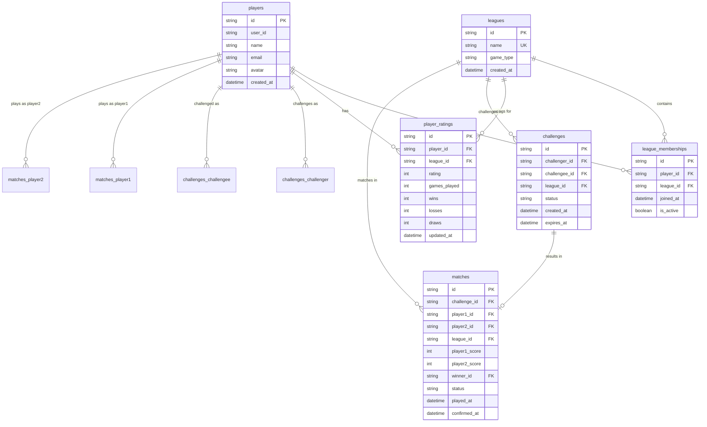

# League Ladder Data Model

This document describes the database schema, entities, and relationships for the League Ladder application.

## Entity-Relationship Diagram (ERD)

---

## Entity-Relationship Diagram (ERD) Description

This section provides a detailed description of the data model entities, their attributes, and relationships for the League Ladder application.

### Entities

#### 1. **players**
Represents individual users/competitors in the system.

**Attributes:**
- `id` (string, Primary Key) - Unique identifier for each player (UUID)
- `user_id` (string) - Links to the users table in the authentication system
- `name` (string) - The player's display name
- `email` (string) - The player's email address (optional)
- `avatar` (string) - URL or identifier for the player's avatar image (optional)
- `created_at` (datetime) - Timestamp when the player record was created

**Relationships:**
- Has zero or many `league_memberships` (joins leagues)
- Has zero or many `player_ratings` (one rating per league)
- Challenges other players as `challenger` in zero or many `challenges`
- Receives challenges as `challengee` in zero or many `challenges`
- Plays as `player1` in zero or many `matches`
- Plays as `player2` in zero or many `matches`
- Can be the `winner` in zero or many `matches`

---

#### 2. **leagues**
Represents different competitive leagues (e.g., FIFA, Table Tennis).

**Attributes:**
- `id` (string, Primary Key) - Unique identifier for each league (e.g., "fifa_league", "tt_league")
- `name` (string, Unique Key) - The display name of the league, must be unique
- `game_type` (string) - The type of game associated with the league (e.g., "fifa", "table-tennis")
- `created_at` (datetime) - Timestamp when the league record was created

**Relationships:**
- Contains zero or many `league_memberships` (players who joined)
- Has zero or many `player_ratings` (ratings for its members)
- Contains zero or many `challenges` (challenges issued within the league)
- Has zero or many `matches` (matches played in the league)

---

#### 3. **player_ratings**
Stores individual player ratings within specific leagues using the Elo rating system.

**Attributes:**
- `id` (string, Primary Key) - Unique identifier for each player rating entry (UUID)
- `player_id` (string, Foreign Key) - References `players.id`
- `league_id` (string, Foreign Key) - References `leagues.id`
- `rating` (int) - The player's Elo rating in that specific league (starts at 1000)
- `games_played` (int) - Total games played by the player in this league
- `wins` (int) - Number of wins in this league
- `losses` (int) - Number of losses in this league
- `draws` (int) - Number of draws in this league
- `updated_at` (datetime) - Timestamp of the last rating update

**Relationships:**
- Belongs to one `player` (via `player_id`)
- Belongs to one `league` (via `league_id`)

**Notes:**
- Each player has one rating record per league they participate in
- Initial rating is 1000 when a player joins a league
- Rating is updated after each completed match

---

#### 4. **challenges**
Records pending or completed challenges between players within a league.

**Attributes:**
- `id` (string, Primary Key) - Unique identifier for each challenge (UUID)
- `challenger_id` (string, Foreign Key) - References `players.id` (the player who initiated the challenge)
- `challengee_id` (string, Foreign Key) - References `players.id` (the player who received the challenge)
- `league_id` (string, Foreign Key) - References `leagues.id` (the league the challenge is for)
- `status` (string) - Current status of the challenge: "pending", "accepted", "declined", "cancelled", or "completed"
- `created_at` (datetime) - Timestamp when the challenge was created
- `expires_at` (datetime) - Timestamp when the challenge automatically expires if not acted upon (optional)

**Relationships:**
- Belongs to one `challenger` player (via `challenger_id`)
- Belongs to one `challengee` player (via `challengee_id`)
- Belongs to one `league` (via `league_id`)
- Results in zero or one `match` (via `challenge_id`)

**Constraints:**
- `challenger_id` cannot equal `challengee_id` (no self-challenges)
- Both players must be members of the same league

---

#### 5. **league_memberships**
Tracks which players are members of which leagues.

**Attributes:**
- `id` (string, Primary Key) - Unique identifier for each membership (UUID)
- `player_id` (string, Foreign Key) - References `players.id`
- `league_id` (string, Foreign Key) - References `leagues.id`
- `joined_at` (datetime) - Timestamp when the player joined the league
- `is_active` (boolean) - Indicates if the player's membership in the league is currently active

**Relationships:**
- Belongs to one `player` (via `player_id`)
- Belongs to one `league` (via `league_id`)

**Constraints:**
- Unique constraint on (`player_id`, `league_id`) - a player can only have one membership per league

---

#### 6. **matches**
Records the results of completed games between players.

**Attributes:**
- `id` (string, Primary Key) - Unique identifier for each match (UUID)
- `challenge_id` (string, Foreign Key, Optional) - References `challenges.id`, linking a match to a specific challenge (nullable)
- `player1_id` (string, Foreign Key) - References `players.id` (the first player in the match)
- `player2_id` (string, Foreign Key) - References `players.id` (the second player in the match)
- `league_id` (string, Foreign Key) - References `leagues.id` (the league the match was played in)
- `player1_score` (int) - Score of player 1 (must be >= 0)
- `player2_score` (int) - Score of player 2 (must be >= 0)
- `winner_id` (string, Foreign Key, Optional) - References `players.id` (the player who won, nullable if it's a draw)
- `status` (string) - Status of the match: "pending", "completed", "cancelled", or "pending_confirmation"
- `played_at` (datetime) - Timestamp when the match was played
- `confirmed_at` (datetime, Optional) - Timestamp when the match results were confirmed

**Relationships:**
- Optionally belongs to one `challenge` (via `challenge_id`) - a match may not always originate from a formal challenge
- Belongs to one `player1` (via `player1_id`)
- Belongs to one `player2` (via `player2_id`)
- Belongs to one `league` (via `league_id`)
- Optionally has one `winner` player (via `winner_id`)

**Constraints:**
- `player1_id` cannot equal `player2_id` (no self-matches)
- `player1_score` must be >= 0
- `player2_score` must be >= 0
- Unique constraint on `challenge_id` - each challenge can result in at most one match

---

### Relationship Summary

1. **players ↔ league_memberships**: A player can join multiple leagues, and a league can have multiple members
2. **players ↔ player_ratings**: A player has one rating per league they participate in
3. **players ↔ challenges**: A player can be both a challenger and challengee in different challenges
4. **leagues ↔ challenges**: Challenges are league-specific
5. **challenges ↔ matches**: A challenge can result in one match (optional relationship)
6. **players ↔ matches**: Players participate in matches as player1, player2, or winner
7. **leagues ↔ matches**: Matches are played within a specific league

---

### Key Design Decisions

1. **Separate ratings per league**: Each player maintains a separate Elo rating for each league they join, allowing players to have different skill levels in different games.

2. **Challenge-to-match relationship**: Matches can be created from challenges, but matches can also be created independently (challenge_id is nullable), providing flexibility for casual matches.

3. **Active membership tracking**: The `is_active` flag in `league_memberships` allows for soft deletion or temporary suspension of league participation without losing historical data.

4. **Comprehensive match tracking**: Matches store both scores and winner, allowing for different game types (e.g., first-to-X wins, best-of-X series).

5. **Status tracking**: Both challenges and matches use status fields to track their lifecycle, enabling proper state management throughout the application.